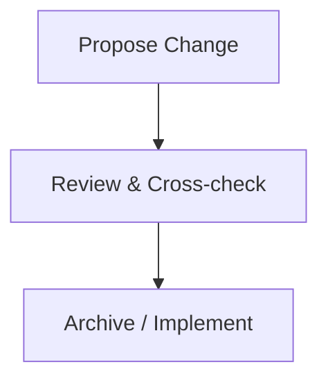

# AGENTS.md - Optimized Canonical Policies

The rules below are **canonical** and **enforceable**. Terms use RFC‑2119 keywords (**MUST/SHOULD/MAY**). Treat **.editorconfig** and **.gitattributes** as the **single source of truth (SoT)** for formatting and encoding.

---

<!-- OPENSPEC:START -->

# OpenSpec Instructions

These instructions are for AI assistants working in this project.

Always open `@/openspec/AGENTS.md` when the request:

- Mentions planning or proposals (words like proposal, spec, change, plan)
- Introduces new capabilities, breaking changes, architecture shifts, or big performance/security work
- Sounds ambiguous and you need the authoritative spec before coding

Use `@/openspec/AGENTS.md` to learn:

- How to create and apply change proposals
- Spec format and conventions
- Project structure and guidelines

Keep this managed block so 'openspec update' can refresh the instructions.

<!-- OPENSPEC:END -->

---

# AGENTS.md

---

## 0) TL;DR (Fast Path)

- **Check tools:** Report `openspec` and `prettier` versions in your first message.
- **Edits:** Use `apply_patch` (structured argv preferred). Include `*** Begin/End Patch` and unified diff hunks.
- **After any `*.md` change:** Run Prettier. Ensure no encoding/line‑ending drift (SoT).
- **Diagrams:** Mermaid ASCII source, quoted labels, live in `specs/`; link from docs.
- **Verify after each edit:** `git status` + `git diff --stat`.
- **Propose/Archive phases:** Follow the checklists below.

---

## 1) CLI Tool Availability Check (Canonical)

- At the **start of each session**, agents **MUST** detect and report the availability **and** version of required CLI tools **in the first message of the session**.
- **git:** run `git --version`; report `git: <version>` or `git: NOT INSTALLED`.
- **openspec:** run `openspec --version`; report `openspec: <version>` or `openspec: NOT INSTALLED`.
- **Prettier:** run `prettier --version`; report `prettier: <version>` or `prettier: NOT INSTALLED`.
- **MarkdownLinkCheck:** run `markdown-link-check --version`; report `markdown-link-check: <version>` or `markdown-link-check: NOT INSTALLED`.
- **Mermaid:** run `mmd --version`; report `mmd: <version>` or `mmd: NOT INSTALLED`.
- **Packer:** run `packer --version`; report `packer: <version>` or `packer: NOT INSTALLED`.
- **Python:** run `python3 --version`; report `python3: <version>` or `python3: NOT INSTALLED`.
- If a tool is missing, you **SHOULD** include a brief install hint or link in that same message.

**Optional helper (bash)**

```bash
check() {
  if command -v "$1" >/dev/null 2>&1; then
    v=$($1 --version 2>/dev/null | head -n1)
    echo "$1: available $v"
  else
    echo "$1: NOT INSTALLED"
  fi
}
check openspec
check prettier
```

**Common pitfalls (DON'T):**

- Omit the version report.
- Assume a tool exists without checking.
- Delay the report to later messages.

---

## 2) `apply_patch` - REQUIRED (Canonical)

- **Nature:** `apply_patch` is a **virtual tool** implemented inside the Codex runner (invoked via `--codex-run-as-apply-patch`). There is **no standalone binary** on `PATH`.
- **Command name:** You **MUST** use `apply_patch`. Do **NOT** use `apply-patch` (hyphen) or other variants. In limited environments `applypatch` may be accepted, but **prefer `apply_patch`** for reliable detection.
- **Patch payload:** The patch text **MUST** include the standard markers `*** Begin Patch` and `*** End Patch`, and use unified-diff hunks (`@@`) with `-`/`+` lines. For file edits, include lines like `*** Update File: path/to/file` (or `*** Add File:` / `*** End Patch`).

### Preferred invocation (structured argv)

Pass the full patch as the **second** argument:

```json
["apply_patch", "*** Begin Patch
*** Update File: path/to/file
@@
- old
+ new
*** End Patch
"]
```

- Rationale: avoids shell parsing issues; runner receives the exact patch buffer.

### Heredoc fallback (when shell script context is required)

Wrap the heredoc in `bash -lc` so it’s parsed like an interactive shell would:

```json
["bash","-lc","apply_patch <<'EOF'
*** Begin Patch
*** Update File: path/to/file
@@
- old
+ new
*** End Patch
EOF
"]
```

- **Do not** pass heredoc tokens as literal argv to `apply_patch` (e.g. `["apply_patch","<<'EOF'...EOF"]`); they will be treated as plain strings and **not** parsed.

### Scripted multi-step usage

If you need a short script (e.g., `cd repo && apply_patch <<'EOF' ...`), either:

- Wrap the **entire** script in `bash -lc "…"`, **or**
- Pass the patch as the second argv directly to `apply_patch` and avoid heredocs altogether.

### Definition of Done (apply_patch)

- The runner acknowledges the patch without parse errors.
- Files are added/updated as intended (verify with `git status`/`git diff --stat`).
- No stray heredoc markers or missing `*** Begin/End Patch` lines.

**Anti‑patterns (avoid):**

- Missing `*** Begin/End Patch` guards.
- Mixed CRLF/LF within the patch body.
- Using `apply-patch`, `git apply`, or `patch` in place of `apply_patch`.

---

## 3) Formatting & Encoding (Canonical)

- **SoT:** `.editorconfig` and `.gitattributes` **MUST** define all formatting/encoding behavior. Do not override locally.
- **Markdown formatting:** After modifying any `*.md` file, you **MUST** format it immediately with Prettier.

  ```bash
  npx prettier --write .
  # or: npm run format
  ```

- **Definition of Done (Formatting):**
  - Prettier has been run with no remaining changes.
  - `git diff --stat` shows only intended edits.
  - No line‑ending or charset drift vs. `.gitattributes`.

**Recommended guardrails:**

- Add a pre‑commit hook that runs `prettier --check` and fails on diff.
- Configure editors to respect `.editorconfig` and to **not** trim or insert BOMs.

---

## 4) Mermaid Diagram Policy (Canonical)

- **Character set:** Mermaid source **MUST** use plain ASCII. Non‑ASCII **MAY** be used **only** inside node/edge labels where unavoidable.
- **Placement:** Diagrams for processes/flows, dependencies, class hierarchies, sequence/call flows, etc. **SHOULD** live in the **specs** directory (best practice).
- **Documentation linkage:** Docs **SHOULD** link to spec diagrams. For complex spec diagrams, docs **MAY** include a simplified companion diagram.
- **Label syntax:** Node labels **MUST** use quoted syntax for consistency, e.g. `A["Label"]` and `B["Another label"]`.
- **Definition of Done (Diagrams):**
  - Diagram is stored in specs; docs contain a link (and optional simplified diagram).
  - All node labels use quoted syntax.
  - Mermaid code is ASCII‑only (labels excepted).

**Quick example (specs/example.mmd):**



---

## 5) Workflow Policy (Canonical)

### 5.1 Immediate Post‑Edit Verification (Enhanced Best Practice)

> Goal: catch unintended diffs, formatting/encoding drift, secrets, and broken docs/tests **before** commit.

**Step‑by‑step checklist (fast path)**

1. **Refresh & scope**
   ```bash
   git update-index -q --refresh
   git status -sb         # short/branch view
   git diff --name-status --find-renames
   ```
2. **High‑signal diffs**
   - Text/code & Markdown:
     ```bash
     git diff --word-diff
     git diff --color-moved=dimmed-zebra
     ```
   - Binary/large assets summary:
     ```bash
     git diff --compact-summary
     ```
3. **Intentional staging (guard against drive‑by changes)**
   ```bash
   git add -p              # stage only what you mean
   git diff --staged --stat
   git diff --staged --word-diff
   ```
4. **SoT conformance (formatting/encoding/line endings)**
   ```bash
   npx prettier --check .
   git ls-files --eol | grep -v "wcrlfattr" || true   # quick glance for unexpected EOLs
   git config --get core.safecrlf || git config core.safecrlf true
   ```
5. **Automated quality gates (run locally)**
   - If configured via **pre‑commit**:
     ```bash
     pre-commit run -a
     ```
   - Otherwise, project linters/tests:
     ```bash
     npm run lint --silent || true
     npm test --silent || true
     ```
6. **Secrets & security (lightweight, fast)**
   ```bash
   gitleaks detect --no-banner --redact || true
   # or: trufflehog filesystem . || true
   ```
7. **Docs/diagram integrity (when docs changed)**
   ```bash
   npx markdownlint . || true
   npx codespell || true
   # Mermaid compile (if CLI present) - ensures syntax is valid
   command -v mmdc >/dev/null && mmdc -i specs/example.mmd -o /dev/null || true
   ```
8. **Final sanity**
   ```bash
   git status -sb
   git diff --staged --stat
   ```

**Definition of Done (Post‑Edit)**

- Only intended files staged; `git diff --staged --stat` matches expectations.
- Prettier passes; no EOL/charset drift (SoT intact).
- Linters/tests (or `pre-commit`) pass locally.
- No secrets detected; binary changes reviewed via compact summary.
- Docs updated compile/lint clean; Mermaid (if present) parses.

**Comparison with current verification**

| Aspect             | Current (in doc)       | Enhanced Best Practice                                               |
| ------------------ | ---------------------- | -------------------------------------------------------------------- |
| Change awareness   | `git status`           | `git status -sb` + rename detection (`--find-renames`)               |
| Diff quality       | `git diff --stat` only | `--word-diff`, `--color-moved`, and `--compact-summary` for binaries |
| Staging discipline | implicit               | interactive `git add -p` + verify staged diff                        |
| SoT enforcement    | implicit               | Prettier **check**, EOL audit, `core.safecrlf=true`                  |
| Automation hooks   | none                   | `pre-commit run -a` (or project `lint`/`test`)                       |
| Secrets            | not covered            | `gitleaks`/`trufflehog` quick scan                                   |
| Docs/diagrams      | not covered            | markdown lint, spell check, optional Mermaid compile                 |
| Final gate         | basic                  | double‑check staged stats + clean status                             |

> Rationale: The enhanced flow keeps the **speed** of the current two‑command check while adding low‑overhead gates that catch the common failure modes (formatting drift, unintended hunks, secrets, moved code diffs, binary noise) **before** CI.

### 5.2 After `/prompts:openspec-propose …` (once proposal is finished and clarified)

After `/prompts:openspec-propose …` (once proposal is finished and clarified)

1. **Open** the corresponding **openspec change**.
2. **Create tasks** (and execute or assign them):
   - Cross‑check against **other specs** for alignment, de‑duplication, and consistency; raise questions if unclear.
   - Cross‑check against **docs** for alignment and consistency; raise questions if unclear.
   - Cross‑check against **implementations** for alignment and consistency; raise questions if unclear.
   - Add or update **Mermaid diagrams** per domain best practice.
3. **Definition of Done (Propose phase):**
   - Cross‑checks completed or open questions filed.
   - Required diagrams added/updated and linked from docs.
   - `git diff --stat` reflects only intended proposal artifacts.

### 5.3 After `/prompts:openspec-archive …` (once archiving succeeds)

1. Verify archiving results:

   ```bash
   openspec list
   openspec list --specs
   openspec list --changes
   ```

2. Stage files covered by the change:

   ```bash
   git add <paths>
   ```

3. Commit with a **detailed** message:

   ```bash
   git commit -m "openspec: <scope> archive <id> - <clear, reader-focused summary>"
   ```

4. Log the change in **CHANGELOG** with sufficient detail (scope, rationale, impact).
5. **Definition of Done (Archive phase):**
   - `openspec list` outputs reflect the archived state.
   - Commit exists with clear message; CHANGELOG entry added.
   - Working tree clean; `git status` shows no unintended changes.

---

## 6) Fast Reference (Agent Checklist)

- [ ] Run Prettier after **any** `*.md` change.
- [ ] Confirm no encoding/line‑ending drift vs. SoT.
- [ ] Mermaid: ASCII source; quoted labels; lives in **specs**; docs link to it (+ simplified diagram if helpful).
- [ ] After edits: `git status` + `git diff --stat`.
- [ ] After **propose**: cross‑check specs/docs/implementations; update diagrams; file questions if needed.
- [ ] After **archive**: verify with `openspec list*`; stage, commit (detailed), update CHANGELOG; ensure clean tree.

---

## 7) Notes & Conventions

- Use consistent terminology: _SoT_, _specs_, _docs_, _implementations_.
- Prefer small, atomic commits aligned to the policy phases above.
- Keep checklists in PR descriptions to show adherence to **Definition of Done**.
