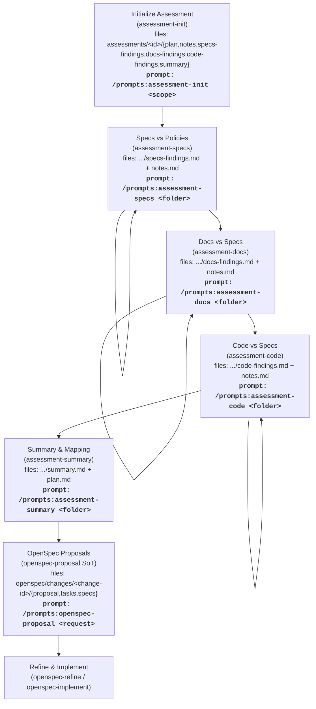
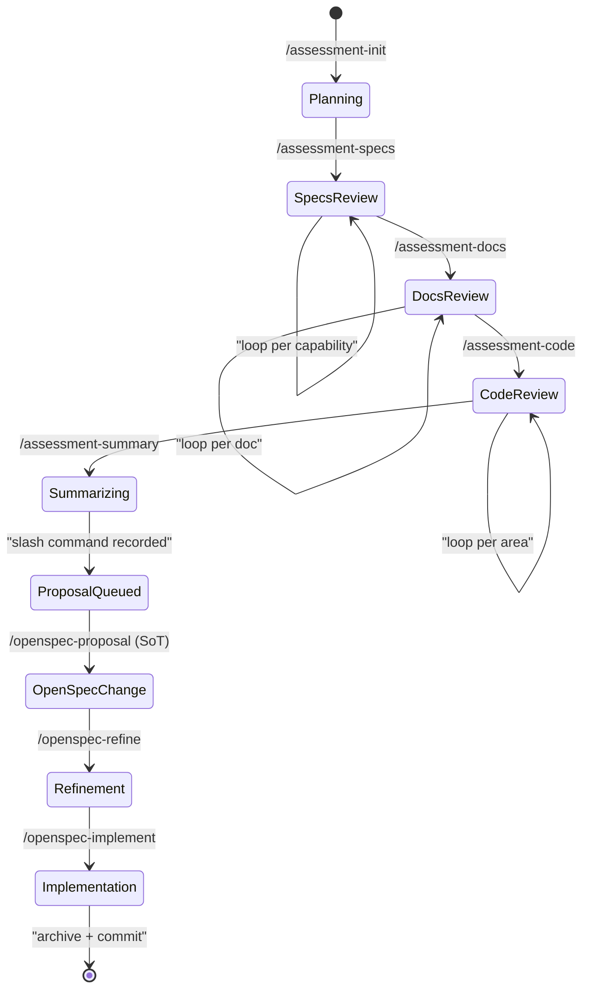

# Assessment Workflow

Slash commands load prompt definitions from `${CODEX_HOME:-~/.codex}/prompts/`. Edit the project-owned sources under `agents/prompts/` and run `tools/update-codex-prompts.sh` to sync them into the active Codex home before invoking `/prompts:...` commands.

## Phase Diagram

## State Diagram

## Notes

- Use `assessments/.template` to scaffold folders.
- `summary.md` must include a "Proposed Changes" table with finding ref, suggested change ID, exact `/prompts:openspec-proposal "..."` command, and status.
- After each proposal is created, update `summary.md` status (e.g., `proposal created`, `implementation in progress`).
- Run `tools/migrate-notes.sh &lt;change-id&gt;` immediately after scaffolding a change to move pending questions from `openspec/project-notes.md` into the change’s `tasks.md` under “Proposal Clarifications.”
- Reference assessment findings inside `proposal.md` so OpenSpec prompts can verify traceability.
