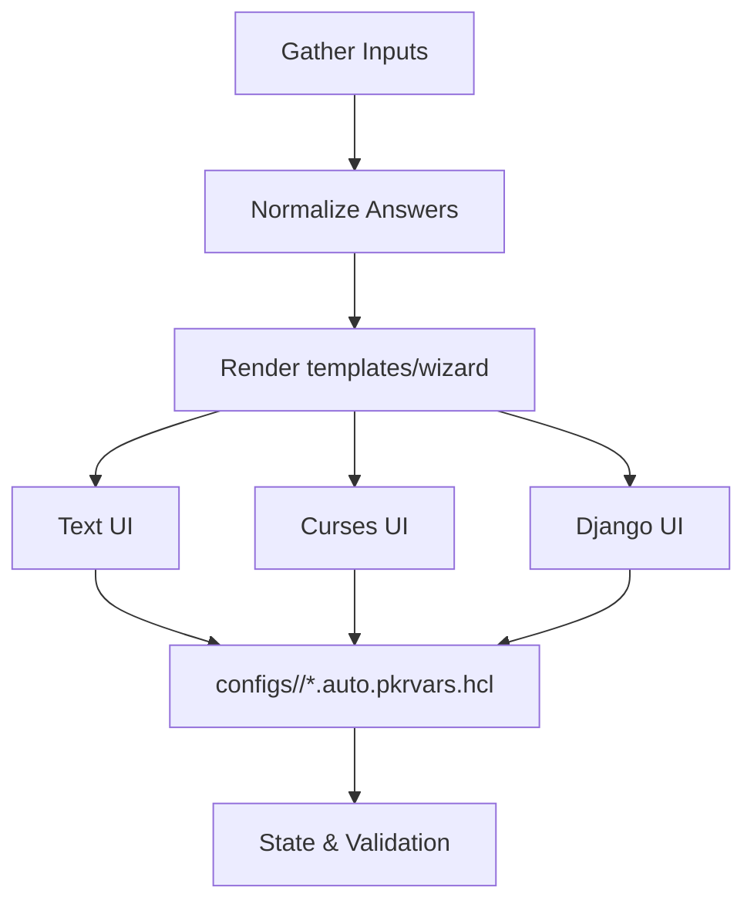

# Wizard UI Overview

This document outlines the simplified flow for the `packer-hybrid wizard` experience. Reference: [specs/cli/spec.md#requirement-wizard-template-consistency](openspec/specs/cli/spec.md#requirement-wizard-template-consistency).

```
Wizard Input -> Normalize Answers -> Render templates/wizard -> Present Text/Curses/Django UI -> Write configs/<env>/*.auto.pkrvars.hcl
```



For the detailed flow (including branching and validation), see the linked spec section—the diagram above is kept in sync with the spec’s Mermaid source.
