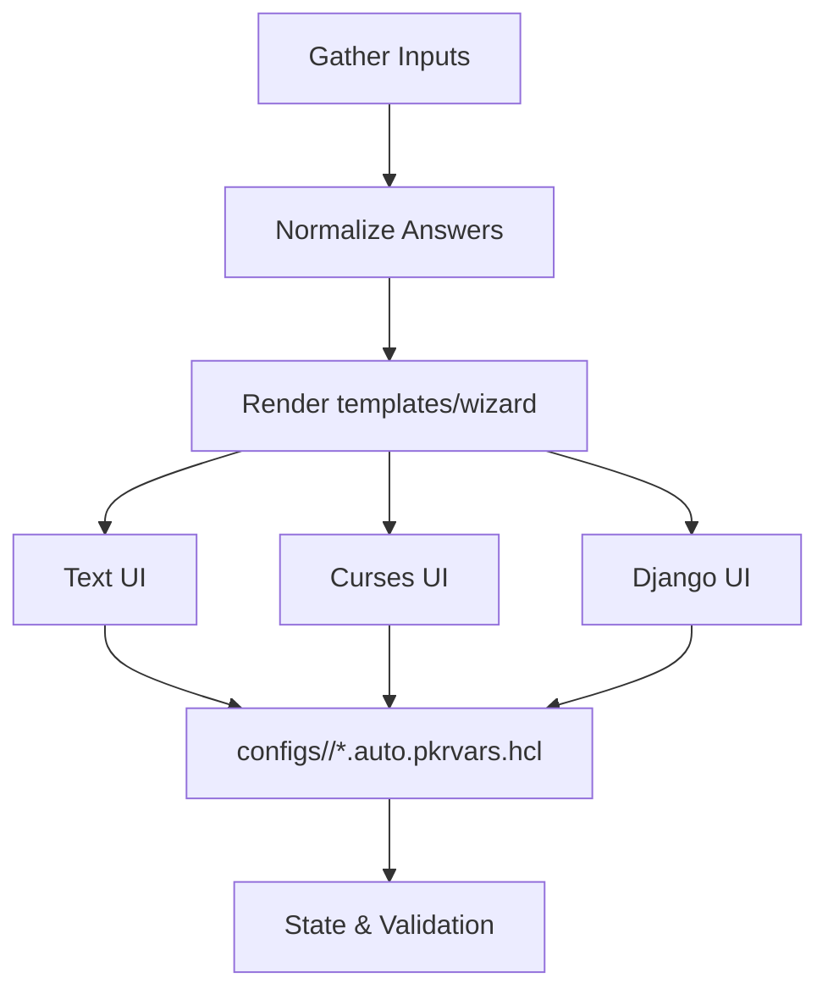

# Wizard UI Overview

This document outlines the simplified flow for the `packer-hybrid wizard` experience. Reference: [specs/cli/spec.md#requirement-wizard-template-consistency](openspec/specs/cli/spec.md#requirement-wizard-template-consistency).

```
Wizard Input -> Normalize Answers -> Render templates/wizard -> Present Text/Curses/Django UI -> Write configs/<env>/*.auto.pkrvars.hcl
```



For the detailed flow (including branching and validation), see the linked spec section—the diagram above is kept in sync with the spec’s Mermaid source.

## Variant Naming Reference

`packer-hybrid wizard` now renders variants using the canonical table defined in [specs/templates/spec.md#requirement-variant-naming-layout](openspec/specs/templates/spec.md#requirement-variant-naming-layout). The simplified view below mirrors the spec diagram (`openspec/specs/templates/variant-flow.md`) so operators can preview which directories map to each variant before generating configs.

| Platform | Example Variant           | Vars Path                                | Scripts Path                                |
| -------- | ------------------------- | ---------------------------------------- | ------------------------------------------- |
| Proxmox  | `linux/base-hardened`     | `templates/vars/linux/base-hardened`     | `templates/scripts/linux/base-hardened`     |
| vSphere  | `windows/win-core-secure` | `templates/vars/windows/win-core-secure` | `templates/scripts/windows/win-core-secure` |
| Azure    | `linux/base-hsm`          | `templates/vars/linux/base-hsm`          | `templates/scripts/linux/base-hsm`          |

Consult the spec for the authoritative diagram and extend this summary whenever new variants are added.
