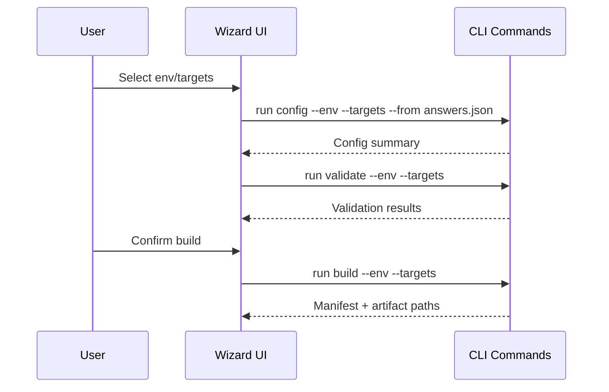

## MODIFIED Requirements

### Requirement: Command Catalogue & Arguments

Each CLI command SHALL expose the arguments below and emit structured stdout/stderr describing actions taken; unrecognized flags MUST cause an error before any side effects.

| Command | Required arguments | Key behaviours |
| ------- | ------------------ | --------------- |
| `init` | `--force` (optional) | Create templates/, configs/, artifacts/, logs/, state/ skeletons, clone sources if missing. |
| `sources sync` | `--all` or `--plugin <name>` | Fetch/checkout plugin/example repos, update metadata in `state/sources.json`, refuse when working tree dirty. |
| `config` | `--env <name>` `--targets <platforms>` `--from <answers.json>` | Render `.auto.pkrvars.hcl`, point secrets to env/secret manager, print generated files. |
| `validate` | `--env <name>` `--targets <platforms>` `--os <ids>` | Run `packer fmt -check`, `packer validate`, surface per-target summaries, stop on first fatal error. |
| `build` | `--env <name>` `--targets <platforms>` `--os <ids>` `--parallelism <n>` | Launch packer builds, stream logs, capture manifests, update `state/packer-hybrid.json`. |
| `publish` | `--env <name>` `--targets <platforms>` | Perform template conversion/SIG replication only if manifests match templates, otherwise fail with drift warning. |
| `status` | `--format {table,json}` | Show plugin versions, repo SHAs, manifest hashes, drift indicators. |
| `inspect` | `--env <name>` `--os <ids>` | Output merged builder/provisioner configs for audit. |
| `clean` | `--scope {work,artifacts,state}` `--yes` | Delete temporary files per scope, never touch templates without explicit flag. |
| `diag` | `--output <path>` | Bundle logs, manifests, state snapshots. |
| `wizard`/`tui` | `--mode {text,curses}` `--export <answers.json>` | Guide users through config/build flows, emitting the same files/commands as non-interactive mode. |

#### Scenario: Argument validation

- **WHEN** an operator runs `packer-hybrid build --env prod --targets proxmox,azure --os ubuntu`
- **THEN** the CLI MUST resolve the builder matrix via hybridcore, run fmt/validate before builds, and error out if any required argument is missing or unknown flags are supplied.

### Requirement: Logging & Error Handling

All commands MUST emit structured logs via `hybridcore.logs`, tagging each message with `command`, `env`, and `targets`; sensitive values (secrets, tokens) MUST be redacted. Non-zero exits SHALL include a JSON or table summary describing the failure, the hybridcore module that raised it, and suggested remediation.

#### Scenario: Redacted logging

- **WHEN** `build` fails because Azure credentials are missing
- **THEN** the CLI MUST log `credential_missing` with redacted identifiers, surface the hybridcore error message, and exit 1 without printing plaintext secrets.

### Requirement: Wizard UX & Sample Flow

The wizard SHALL display the same steps as `config` → `validate` → `build` with progress indicators, allow exporting answers to JSON, and accept re-importing them for repeatable runs. ASCII UI and curses UI MUST follow the flow below:

#### Scenario: Wizard export/import

- **WHEN** the user exports answers via `wizard --export answers.json`
- **THEN** rerunning the wizard with `--from answers.json` MUST skip already-provided answers and still log every delegated command.

### Requirement: Verification & Testing Gates

Every command execution MUST respect the verification checklist:

- `init/sources` → run `git status` on sources, ensure pinned SHAs recorded.
- `config` → validate schema, ensure secrets referenced via env/secret manager.
- `validate` → run `packer fmt -check` + `packer validate`.
- `build` → ensure `validate` passed in same run, detect drift, require clean working tree.
- `publish` → compare manifests vs templates before proceeding.
- `status/inspect` → provide machine-readable output for CI assertions.

Unit tests SHALL cover argument parsing, hybridcore integration points, and error handling for each command; integration tests SHALL run `packer fmt -check` and `python -m unittest` in CI per `openspec/project.md`.

#### Scenario: CI enforcement

- **WHEN** `make test-cli` runs
- **THEN** it MUST execute unit tests for command parsers plus invoke `packer fmt -check`/`packer validate` on sample templates, failing if verification gates are skipped.
