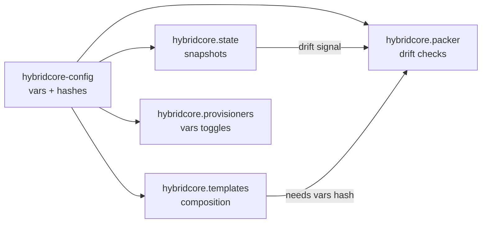

```mermaid
flowchart LR
  Vars["hybridcore-config<br/>vars + hashes"]
  State["hybridcore.state<br/>snapshots"]
  Templates["hybridcore.templates<br/>composition"]
  Packer["hybridcore.packer<br/>drift checks"]
  Provisioners["hybridcore.provisioners<br/>vars toggles"]

  Vars --> State
  Vars --> Templates
  Vars --> Packer
  Vars --> Provisioners
  State -->|drift signal| Packer
  Templates -->|needs vars hash| Packer
```
