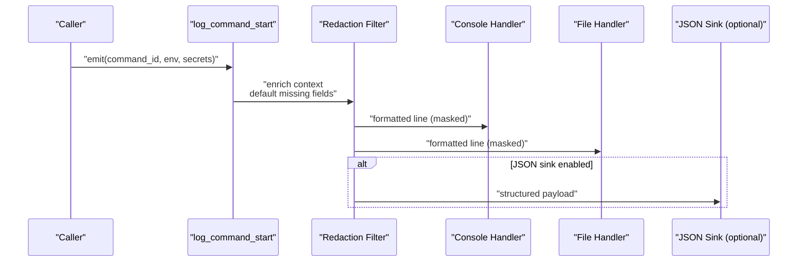

```mermaid
sequenceDiagram
  participant Caller as "Caller"
  participant Helper as "log_command_start"
  participant Filter as "Redaction Filter"
  participant Console as "Console Handler"
  participant File as "File Handler"
  participant Json as "JSON Sink (optional)"
  Caller->>Helper: "emit(command_id, env, secrets)"
  Helper->>Filter: "enrich context<br/>default missing fields"
  Filter->>Console: "formatted line (masked)"
  Filter->>File: "formatted line (masked)"
  alt JSON sink enabled
    Filter->>Json: "structured payload"
  end
```
