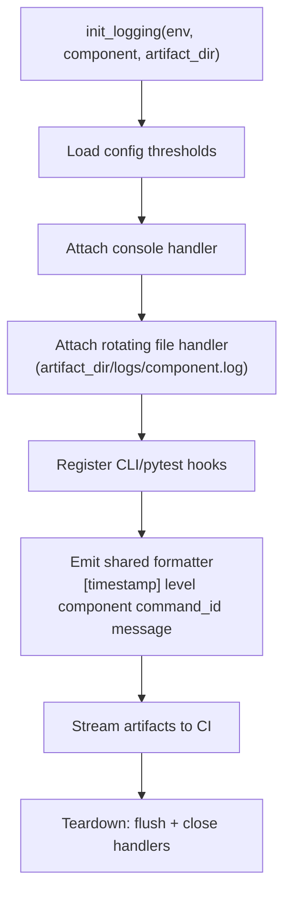

```mermaid
flowchart TD
  A["init_logging(env, component, artifact_dir)"] --> B["Load config thresholds"]
  B --> C["Attach console handler"]
  C --> D["Attach rotating file handler<br/>(artifact_dir/logs/component.log)"]
  D --> E["Register CLI/pytest hooks"]
  E --> F["Emit shared formatter<br/>[timestamp] level component command_id message"]
  F --> G["Stream artifacts to CI"]
  G --> H["Teardown: flush + close handlers"]
```
