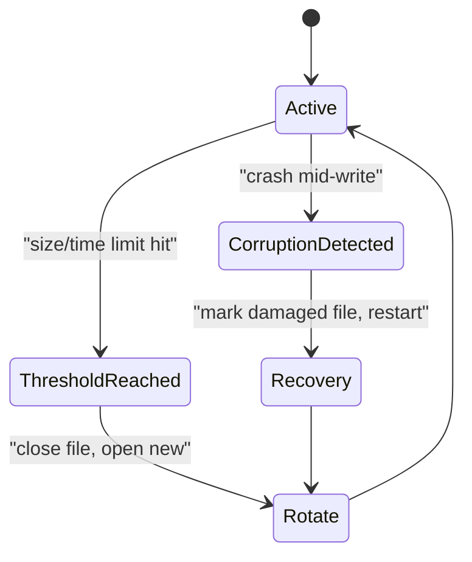

```mermaid
stateDiagram-v2
  [*] --> Active
  Active --> ThresholdReached: "size/time limit hit"
  ThresholdReached --> Rotate: "close file, open new"
  Active --> CorruptionDetected: "crash mid-write"
  CorruptionDetected --> Recovery: "mark damaged file, restart"
  Recovery --> Rotate
  Rotate --> Active
```
