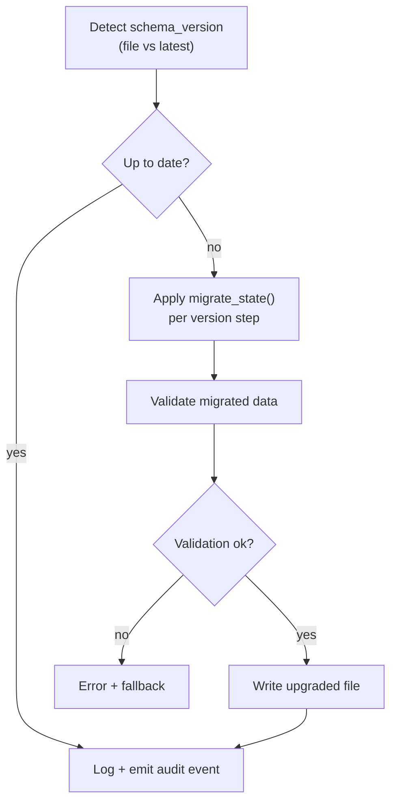

```mermaid
flowchart TD
  A["Detect schema_version<br/>(file vs latest)"]
  B{"Up to date?"}
  C["Apply migrate_state()<br/>per version step"]
  D["Validate migrated data"]
  E{"Validation ok?"}
  F["Write upgraded file"]
  G["Log + emit audit event"]
  H["Error + fallback"]

  A --> B
  B -- yes --> G
  B -- no --> C --> D --> E
  E -- yes --> F --> G
  E -- no --> H
```
