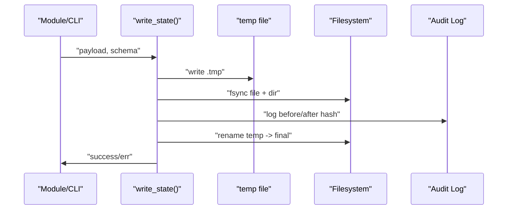

```mermaid
sequenceDiagram
  participant Caller as "Module/CLI"
  participant API as "write_state()"
  participant Temp as "temp file"
  participant FS as "Filesystem"
  participant Audit as "Audit Log"

  Caller->>API: "payload, schema"
  API->>Temp: "write .tmp"
  API->>FS: "fsync file + dir"
  API->>Audit: "log before/after hash"
  API->>FS: "rename temp -> final"
  API->>Caller: "success/err"
```
