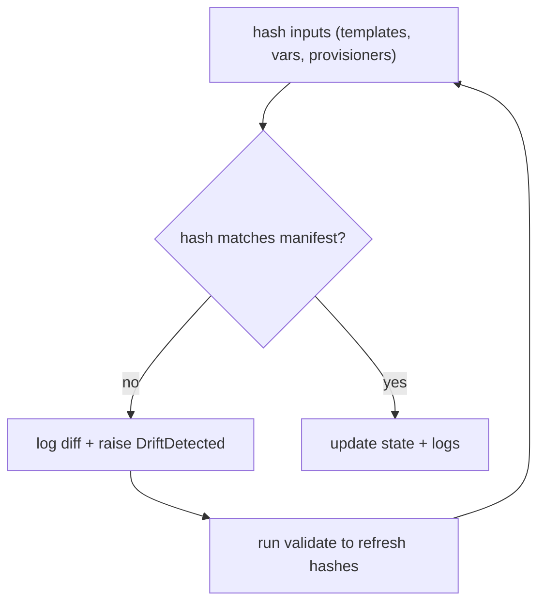

```mermaid
flowchart TD
  A["hash inputs (templates, vars, provisioners)"]
  B{"hash matches manifest?"}
  C["log diff + raise DriftDetected"]
  D["run validate to refresh hashes"]
  E["update state + logs"]

  A --> B
  B -- no --> C --> D --> A
  B -- yes --> E
```
