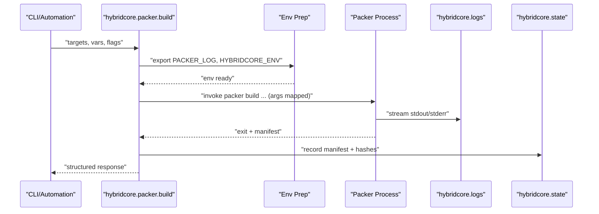

```mermaid
sequenceDiagram
  participant Caller as "CLI/Automation"
  participant Wrapper as "hybridcore.packer.build"
  participant Env as "Env Prep"
  participant Proc as "Packer Process"
  participant Logs as "hybridcore.logs"
  participant State as "hybridcore.state"

  Caller->>Wrapper: "targets, vars, flags"
  Wrapper->>Env: "export PACKER_LOG, HYBRIDCORE_ENV"
  Env-->>Wrapper: "env ready"
  Wrapper->>Proc: "invoke packer build ... (args mapped)"
  Proc->>Logs: "stream stdout/stderr"
  Proc-->>Wrapper: "exit + manifest"
  Wrapper->>State: "record manifest + hashes"
  Wrapper-->>Caller: "structured response"
```
