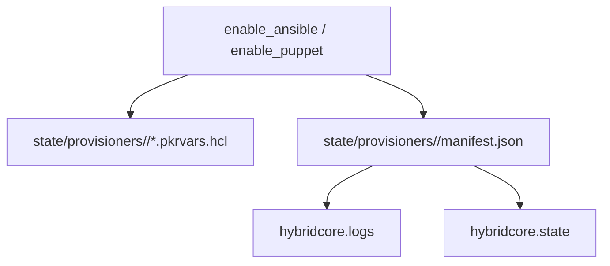

```mermaid
flowchart TD
  Toggle["enable_ansible / enable_puppet"] --> Vars["state/provisioners/<env>/*.pkrvars.hcl"]
  Toggle --> Manifest["state/provisioners/<env>/manifest.json"]
  Manifest --> Logs["hybridcore.logs"]
  Manifest --> State["hybridcore.state"]
```
