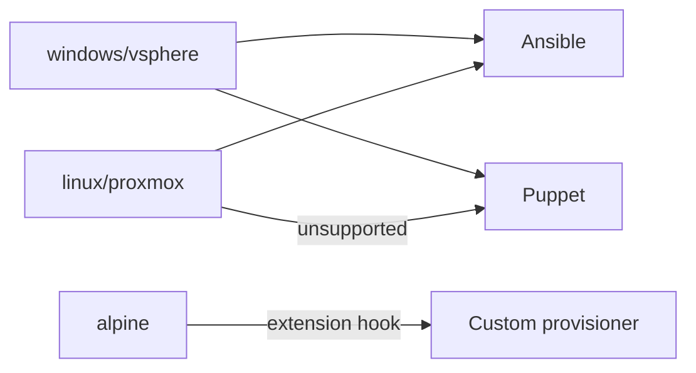

```mermaid
flowchart LR
  OS1["windows/vsphere"] --> Ansible["Ansible"]
  OS1 --> Puppet["Puppet"]
  OS2["linux/proxmox"] --> Ansible
  OS2 -->|unsupported| Puppet
  OS3["alpine"] -->|extension hook| Future["Custom provisioner"]
```
