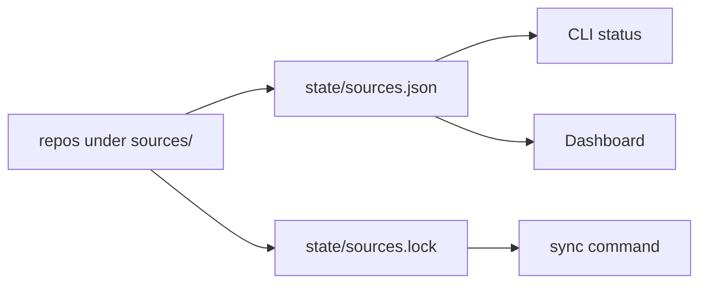

```mermaid
flowchart LR
  Repos["repos under sources/"] --> StateJson["state/sources.json"]
  Repos --> Lock["state/sources.lock"]
  StateJson --> CLI["CLI status"]
  StateJson --> Dashboard["Dashboard"]
  Lock --> Sync["sync command"]
```
