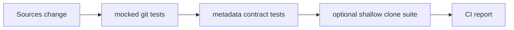

```mermaid
flowchart LR
  Change["Sources change"] --> Mock["mocked git tests"]
  Mock --> Contract["metadata contract tests"]
  Contract --> Integrations["optional shallow clone suite"]
  Integrations --> Report["CI report"]
```
