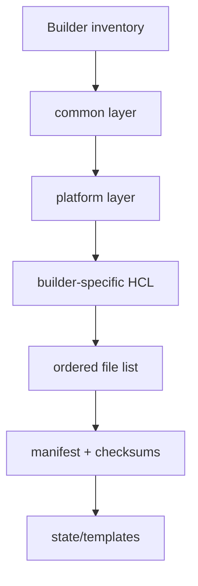

```mermaid
flowchart TD
  Inventory["Builder inventory"] --> Common["common layer"]
  Common --> Platform["platform layer"]
  Platform --> BuilderHCL["builder-specific HCL"]
  BuilderHCL --> Outputs["ordered file list"]
  Outputs --> Manifest["manifest + checksums"]
  Manifest --> State["state/templates"]
```
