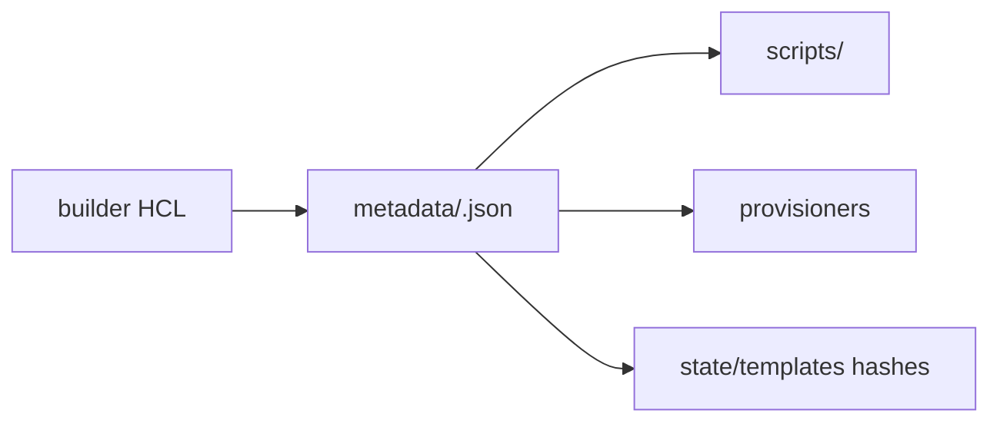

```mermaid
flowchart LR
  Builder["builder HCL"] --> Metadata["metadata/<builder>.json"]
  Metadata --> Scripts["scripts/"]
  Metadata --> Provisioners["provisioners"]
  Metadata --> StateRef["state/templates hashes"]
```
