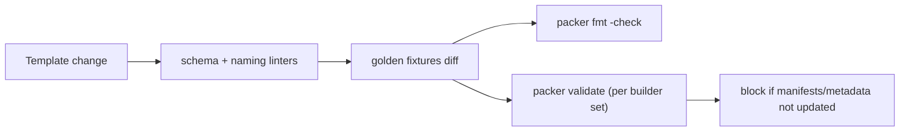

```mermaid
flowchart LR
  Change["Template change"] --> Linters["schema + naming linters"]
  Linters --> Golden["golden fixtures diff"]
  Golden --> PackerFmt["packer fmt -check"]
  Golden --> PackerValidate["packer validate (per builder set)"]
  PackerValidate --> Blocker["block if manifests/metadata not updated"]
```
