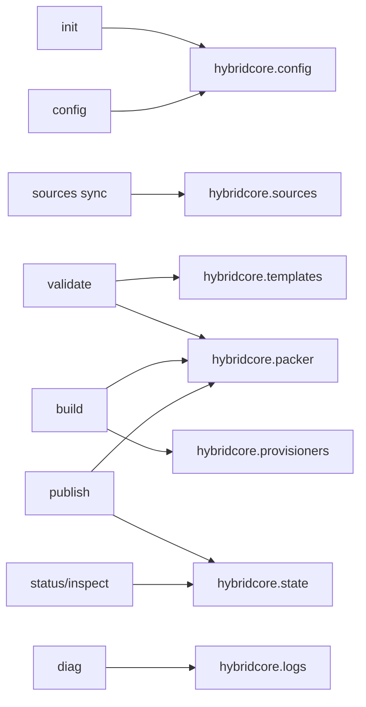

```mermaid
flowchart LR
  Init["init"] --> Config["hybridcore.config"]
  SourcesSync["sources sync"] --> Sources["hybridcore.sources"]
  ConfigCmd["config"] --> Config
  ValidateCmd["validate"] --> Templates["hybridcore.templates"]
  ValidateCmd --> Packer["hybridcore.packer"]
  BuildCmd["build"] --> Packer
  BuildCmd --> Provisioners["hybridcore.provisioners"]
  PublishCmd["publish"] --> State["hybridcore.state"]
  PublishCmd --> Packer
  StatusCmd["status/inspect"] --> State
  DiagCmd["diag"] --> Logs["hybridcore.logs"]
```
