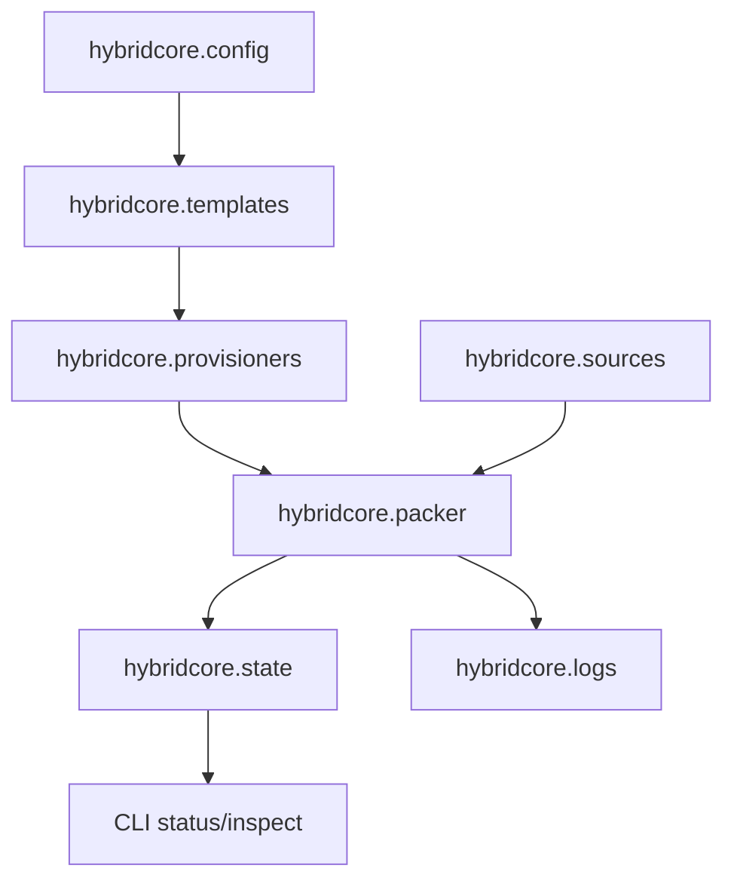

```mermaid
flowchart TD
  Config["hybridcore.config"] --> Templates["hybridcore.templates"]
  Templates --> Provisioners["hybridcore.provisioners"]
  Provisioners --> Packer["hybridcore.packer"]
  Sources["hybridcore.sources"] --> Packer
  Packer --> State["hybridcore.state"]
  Packer --> Logs["hybridcore.logs"]
  State --> CLI["CLI status/inspect"]
```
