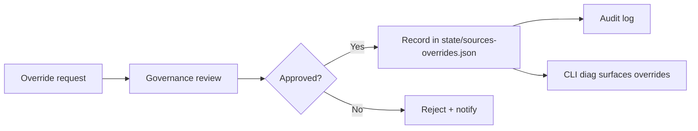

```mermaid
flowchart LR
  Requester["Override request"] --> Governance["Governance review"]
  Governance --> Approval{"Approved?"}
  Approval -->|Yes| State["Record in state/sources-overrides.json"]
  State --> Audit["Audit log"]
  Approval -->|No| Reject["Reject + notify"]
  State --> CLI["CLI diag surfaces overrides"]
```
