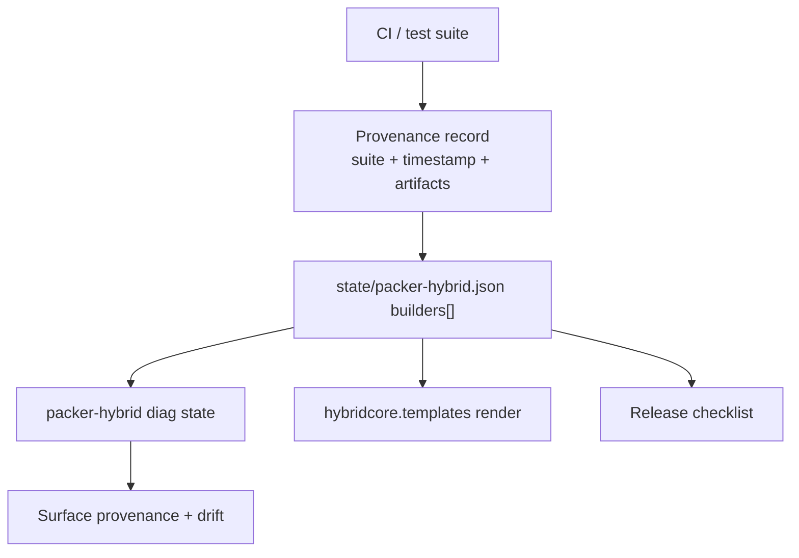

```mermaid
flowchart TD
  Tests["CI / test suite"] --> Provenance["Provenance record\nsuite + timestamp + artifacts"]
  Provenance --> Snapshot["state/packer-hybrid.json builders[]"]
  Snapshot --> Diagnostics["packer-hybrid diag state"]
  Snapshot --> Templates["hybridcore.templates render"]
  Snapshot --> Releases["Release checklist"]
  Diagnostics --> Report["Surface provenance + drift"]
```
