# OpenSpec Workflow Overview

The diagram below maps each prompt to its phase in the OpenSpec lifecycle and highlights the primary files or directories affected during that phase.

```mermaid
flowchart TD
    A["Context & Tech Stack<br>(openspec-project)<br>files: openspec/project.md<br><b><code>prompt: /prompts:openspec-project</code></b>"] --> B["Proposal Scaffolding<br>(openspec-proposal)<br>files: openspec/changes/&lt;id&gt;/{proposal.md,tasks.md,design.md,specs/}<br><b><code>prompt: /prompts:openspec-proposal &lt;request&gt;</code></b>"]
    B --> C["Proposal Refinement<br>(openspec-refine)<br>files: openspec/changes/&lt;id&gt;/{proposal.md,tasks.md,design.md,specs/}<br><b><code>prompt: /prompts:openspec-refine &lt;change-id&gt;</code></b>"]
    C -->|"<refine until approvals ready>"| C
    C -->|"<revise proposal as needed>"| B
    C --> D["Stakeholder Approval<br>(openspec-approve)<br>files: openspec/changes/&lt;id&gt;/{proposal.md,tasks.md,specs/}<br><b><code>prompt: /prompts:openspec-approve &lt;change-id&gt;</code></b>"]
    D --> E["Implementation Kickoff<br>(openspec-apply)<br>files: openspec/changes/&lt;id&gt;/tasks.md + codebase<br><b><code>prompt: /prompts:openspec-apply &lt;change-id&gt;</code></b>"]
    E --> F["Implementation Progress<br>(openspec-implement)<br>files: openspec/changes/&lt;id&gt;/tasks.md + src/**/*<br><b><code>prompt: /prompts:openspec-implement &lt;change-id&gt;</code></b>"]
    F -->|"<loop until tasks complete>"| F
    F --> G["Archive & Spec Sync<br>(openspec-archive)<br>files: openspec/changes/&lt;id&gt;/ → openspec/changes/archive/, openspec/specs<br><b><code>prompt: /prompts:openspec-archive &lt;change-id&gt;</code></b>"]
    G --> H["Stage Changes<br>(git-stage)<br>files: staged repo files incl. specs/code<br><b><code>prompt: /prompts:git-stage &lt;change-id&gt;</code></b>"]
    H --> I["Commit Changes<br>(git-commit)<br>files: git history referencing change-id<br><b><code>prompt: /prompts:git-commit &lt;change-id&gt;</code></b>"]
```

## Phase Notes

- **Context & Tech Stack** (`openspec-project`): gather or confirm `openspec/project.md` details before editing specs.
- **Proposal Scaffolding** (`openspec-proposal`): create `proposal.md`, `tasks.md`, optional `design.md`, and spec deltas under `openspec/changes/<id>/`.
- **Proposal Refinement** (`openspec-refine`): iterate on requirements/questions and update the same change folder.
- **Stakeholder Approval** (`openspec-approve`): log approvals per stakeholder after `openspec validate <id> --strict` passes.
- **Implementation Kickoff** (`openspec-apply`) and **Progress** (`openspec-implement`): execute `tasks.md`, keeping code/spec updates aligned.
- **Archive & Spec Sync** (`openspec-archive`): move the change into `openspec/changes/archive/` and ensure deployed specs match.
- **Stage & Commit** (`git-stage`, `git-commit`): default sequence after archiving to prepare and commit all artifacts referencing the change ID.

## State & Prompt Transition View

This state diagram highlights which prompt transitions the change from one stage to the next, reinforcing when to rerun refinement, approvals, or implementation loops.
