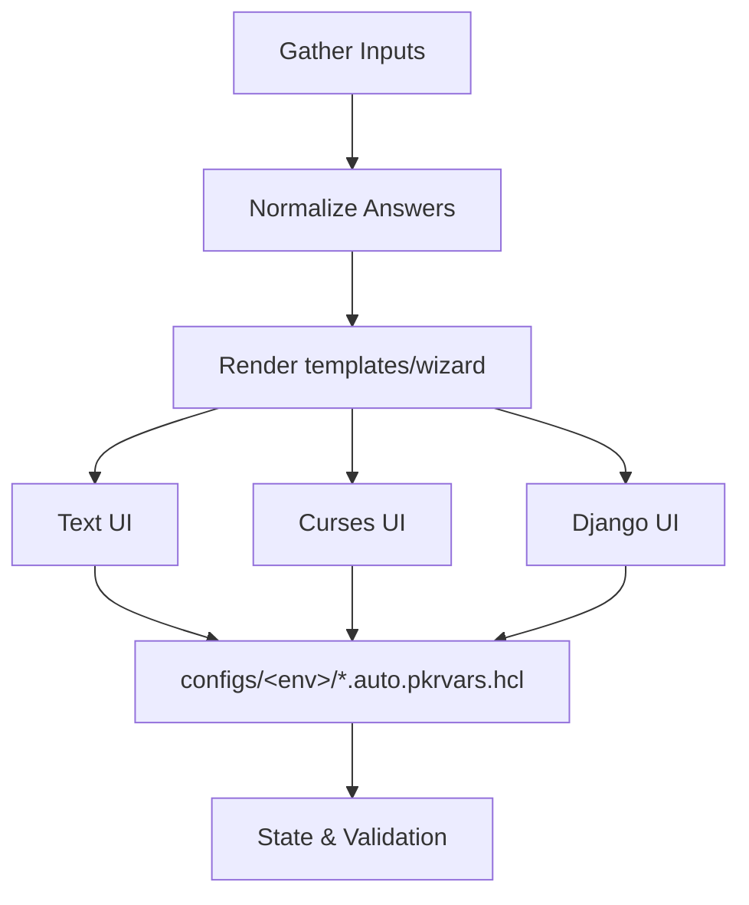
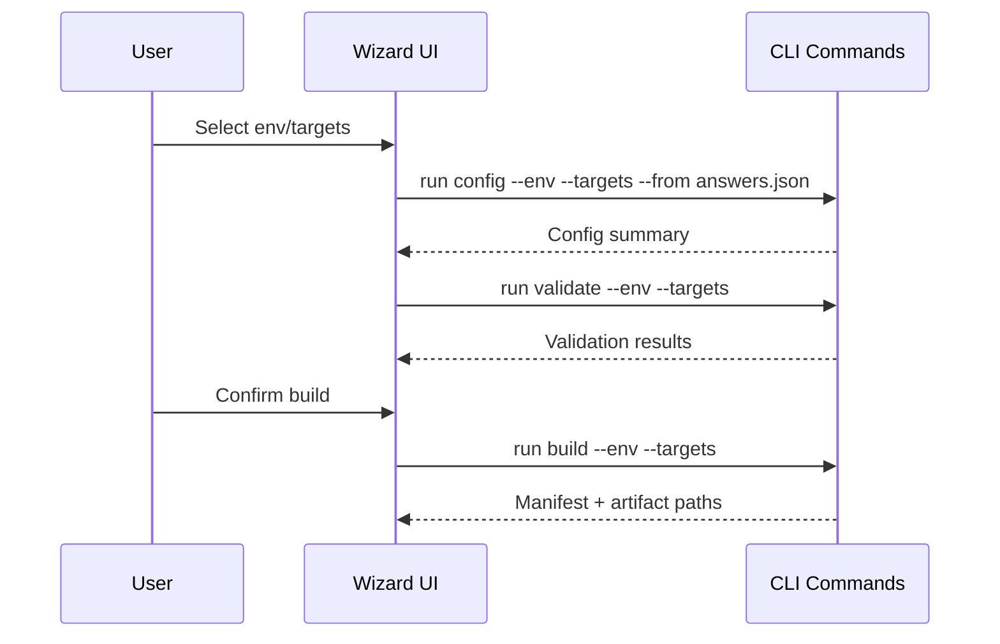

# cli Specification

## Purpose

Define the packer-hybrid CLI surface—commands, arguments, logging, wizard/TUI expectations, and the verification gates each command must enforce—so implementations across CLI and future UIs behave consistently.

## Requirements

### Requirement: Deterministic Command Surface

The CLI SHALL expose the subcommands `init`, `sources sync`, `config`, `validate`, `build`, `publish`, `status`/`inspect`, `clean`, `diag`, and optional `wizard`/`tui`, each with stable semantics.

#### Scenario: Deterministic execution

- **WHEN** an operator invokes any command with the same inputs
- **THEN** the CLI MUST produce identical file layout, stdout/stderr structure, and exit codes (0 on success, non-zero on failure) regardless of environment.

### Requirement: Hybridcore Integration

All CLI commands MUST execute through the `hybridcore` package rather than reimplementing logic.

#### Scenario: Shared orchestration

- **GIVEN** hybridcore modules handle config rendering, source syncing, template composition, provisioner toggles, packer orchestration, state storage, and logging
- **WHEN** the CLI runs a subcommand
- **THEN** it MUST call the corresponding hybridcore API and surface errors/logs verbatim.

### Requirement: Validation Gate

`packer-hybrid validate` SHALL run `packer fmt -check` and `packer validate` for each targeted OS/platform tuple and fail fast on the first error.

#### Scenario: Targeted validation

- **WHEN** `--targets proxmox,vsphere,azure` is passed
- **THEN** the command MUST only evaluate those builders and report individual success/failure summaries.

### Requirement: Build & Publish Flow

`build` MUST orchestrate parallel packer builds per platform using merged configs, capture manifests, update `state/packer-hybrid.json`, and stream logs. `publish` MUST handle post-build actions (template conversion, Azure SIG replication) and refuse to run if manifests and state diverge.

#### Scenario: Manifest enforcement

- **GIVEN** the previous build manifest hash differs from the current templates
- **WHEN** `publish` is invoked
- **THEN** it MUST exit non-zero and instruct the operator to rerun `build`.

### Requirement: Interactive Wizard

The optional `wizard`/`tui` SHALL wrap non-interactive commands without diverging behaviour.

#### Scenario: Wizard parity

- **WHEN** an operator generates configs via the wizard
- **THEN** the CLI MUST emit the same files as `packer-hybrid config --env <env> --from answers.json` and log the underlying commands executed.

### Requirement: Diagnostics

`packer-hybrid diag` MUST collect recent logs, manifests, and state snapshots into an archive for troubleshooting.

#### Scenario: Diag bundle

- **WHEN** `diag` executes
- **THEN** it SHALL gather `logs/*.log`, the latest manifests in `artifacts/`, and `state/packer-hybrid.json`, store them under `artifacts/diag/<timestamp>.tar.gz`, and report the file path.

### Requirement: Wizard Template Consistency

The wizard SHALL render UI layouts from shared assets under `templates/wizard/`, ensuring text-only, curses, and future Django flows share the same content blocks and validation rules.

#### Scenario: Unified layouts

- **WHEN** an operator launches the wizard in text mode, curses UI, or via the Django frontend
- **THEN** all three MUST render the same prompts, validation, and output structure sourced from `templates/wizard/`, differing only in presentation layers.

### Requirement: Command Catalogue & Arguments

Each CLI command SHALL expose the arguments below and emit structured stdout/stderr describing actions taken; unrecognized flags MUST cause an error before any side effects.

| Command        | Required arguments                                                      | Key behaviours                                                                                                    |
| -------------- | ----------------------------------------------------------------------- | ----------------------------------------------------------------------------------------------------------------- |
| `init`         | `--force` (optional)                                                    | Create templates/, configs/, artifacts/, logs/, state/ skeletons, clone sources if missing.                       |
| `sources sync` | `--all` or `--plugin <name>`                                            | Fetch/checkout plugin/example repos, update metadata in `state/sources.json`, refuse when working tree dirty.     |
| `config`       | `--env <name>` `--targets <platforms>` `--from <answers.json>`          | Render `.auto.pkrvars.hcl`, point secrets to env/secret manager, print generated files.                           |
| `validate`     | `--env <name>` `--targets <platforms>` `--os <ids>`                     | Run `packer fmt -check`, `packer validate`, surface per-target summaries, stop on first fatal error.              |
| `build`        | `--env <name>` `--targets <platforms>` `--os <ids>` `--parallelism <n>` | Launch packer builds, stream logs, capture manifests, update `state/packer-hybrid.json`.                          |
| `publish`      | `--env <name>` `--targets <platforms>`                                  | Perform template conversion/SIG replication only if manifests match templates, otherwise fail with drift warning. |
| `status`       | `--format {table,json}`                                                 | Show plugin versions, repo SHAs, manifest hashes, drift indicators.                                               |
| `inspect`      | `--env <name>` `--os <ids>`                                             | Output merged builder/provisioner configs for audit.                                                              |
| `clean`        | `--scope {work,artifacts,state}` `--yes`                                | Delete temporary files per scope, never touch templates without explicit flag.                                    |
| `diag`         | `--output <path>`                                                       | Bundle logs, manifests, state snapshots.                                                                          |
| `wizard`/`tui` | `--mode {text,curses}` `--export <answers.json>`                        | Guide users through config/build flows, emitting the same files/commands as non-interactive mode.                 |

#### Scenario: Argument validation

- **WHEN** an operator runs `packer-hybrid build --env prod --targets proxmox,azure --os ubuntu`
- **THEN** the CLI MUST resolve the builder matrix via hybridcore, run fmt/validate before builds, and error out if any required argument is missing or unknown flags are supplied.

### Requirement: Logging & Error Handling

All commands MUST emit structured logs via `hybridcore.logs`, tagging each message with `command`, `env`, and `targets`; sensitive values (secrets, tokens) MUST be redacted. Non-zero exits SHALL include a JSON or table summary describing the failure, the hybridcore module that raised it, and suggested remediation.

#### Scenario: Redacted logging

- **WHEN** `build` fails because Azure credentials are missing
- **THEN** the CLI MUST log `credential_missing` with redacted identifiers, surface the hybridcore error message, and exit 1 without printing plaintext secrets.

### Requirement: Wizard UX & Sample Flow

The wizard SHALL display the same steps as `config` → `validate` → `build` with progress indicators, allow exporting answers to JSON, and accept re-importing them for repeatable runs. ASCII UI and curses UI MUST follow the flow below:

#### Scenario: Wizard export/import

- **WHEN** the user exports answers via `wizard --export answers.json`
- **THEN** rerunning the wizard with `--from answers.json` MUST skip already-provided answers and still log every delegated command.

### Requirement: Verification & Testing Gates

Every command execution MUST respect the verification checklist:

- `init/sources` → run `git status` on sources, ensure pinned SHAs recorded.
- `config` → validate schema, ensure secrets referenced via env/secret manager.
- `validate` → run `packer fmt -check` + `packer validate`.
- `build` → ensure `validate` passed in same run, detect drift, require clean working tree.
- `publish` → compare manifests vs templates before proceeding.
- `status/inspect` → provide machine-readable output for CI assertions.

Unit tests SHALL cover argument parsing, hybridcore integration points, and error handling for each command; integration tests SHALL run `packer fmt -check` and `python -m unittest` in CI per `openspec/project.md`.

#### Scenario: CI enforcement

- **WHEN** `make test-cli` runs
- **THEN** it MUST execute unit tests for command parsers plus invoke `packer fmt -check`/`packer validate` on sample templates, failing if verification gates are skipped.

### Requirement: Command Semantics & Validation

CLI commands `publish`, `clean`, `diag`, `status`, and `wizard` SHALL document required args, validation gates, and exit codes (table added to spec) so operators know deterministic behaviours. See `specs/cli/command-module-map.md` for module interactions.

#### Scenario: Publish semantics

- **WHEN** `publish --env prod` runs
- **THEN** the CLI MUST run drift detection, refuse to continue when manifests mismatch, and exit with code 2 on validation failure.

### Requirement: Logging & Error Handling (updated)

Logging behaviour SHALL explicitly describe `--verbose`, `--quiet`, and `--json` semantics aligned with `hybridcore-logs` so operators know how to configure diagnostics.

#### Scenario: Verbose logging

- **WHEN** `build --verbose` fails because credentials are missing
- **THEN** the CLI MUST emit DEBUG logs via `hybridcore.logs` while redacting sensitive values.

### Requirement: Command → Module Mapping

The CLI spec SHALL reference `specs/cli/command-module-map.md` (new diagram) showing how commands call hybridcore modules, and contributors SHALL keep it aligned whenever commands change.

#### Scenario: Diagram upkeep

- **WHEN** a new command is added
- **THEN** the diagram MUST be updated and referenced from the CLI spec.

### Requirement: Open Issues Tracking

The cli spec SHALL keep a `## Open Issues` section pointing to `docs/spec-remediations/cli-remediations.md`. Assessments MUST summarize outstanding gaps per dimension in that doc and cross-reference it from the spec.

#### Scenario: Remediation linkage

- **WHEN** a spec assessment uncovers deviations for the cli spec
- **THEN** contributors SHALL update `docs/spec-remediations/cli-remediations.md` and refresh the spec's `## Open Issues` pointer before merging changes.

## Open Issues

See `docs/spec-remediations/cli-remediations.md`.
