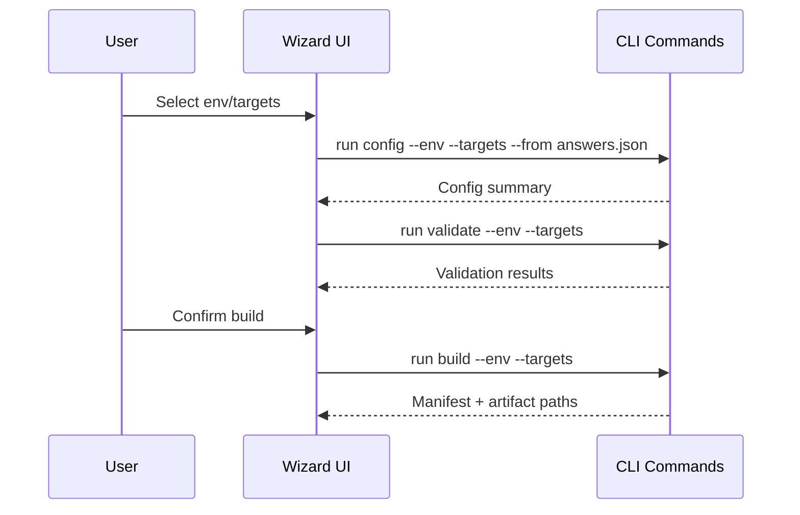

# cli Specification

## Purpose

Define the packer-hybrid CLI surface—commands, arguments, logging, wizard/TUI expectations, and the verification gates each command must enforce—so implementations across CLI and future UIs behave consistently.
## Requirements
### Requirement: Deterministic Command Surface

The CLI SHALL expose the subcommands `init`, `sources sync`, `config`, `validate`, `build`, `publish`, `status`/`inspect`, `clean`, `diag`, and optional `wizard`/`tui`, each with stable semantics.

#### Scenario: Deterministic execution

- **WHEN** an operator invokes any command with the same inputs
- **THEN** the CLI MUST produce identical file layout, stdout/stderr structure, and exit codes (0 on success, non-zero on failure) regardless of environment.

### Requirement: Hybridcore Integration

All CLI commands MUST execute through the `hybridcore` package rather than reimplementing logic.

#### Scenario: Shared orchestration

- **GIVEN** hybridcore modules handle config rendering, source syncing, template composition, provisioner toggles, packer orchestration, state storage, and logging
- **WHEN** the CLI runs a subcommand
- **THEN** it MUST call the corresponding hybridcore API and surface errors/logs verbatim.

### Requirement: Validation Gate

`packer-hybrid validate` SHALL run `packer fmt -check` and `packer validate` for each targeted OS/platform tuple and fail fast on the first error.

#### Scenario: Targeted validation

- **WHEN** `--targets proxmox,vsphere,azure` is passed
- **THEN** the command MUST only evaluate those builders and report individual success/failure summaries.

### Requirement: Build & Publish Flow

`build` MUST orchestrate parallel packer builds per platform using merged configs, capture manifests, update `state/packer-hybrid.json`, and stream logs. `publish` MUST handle post-build actions (template conversion, Azure SIG replication) and refuse to run if manifests and state diverge.

#### Scenario: Manifest enforcement

- **GIVEN** the previous build manifest hash differs from the current templates
- **WHEN** `publish` is invoked
- **THEN** it MUST exit non-zero and instruct the operator to rerun `build`.

### Requirement: Interactive Wizard

The optional `wizard`/`tui` SHALL wrap non-interactive commands without diverging behaviour.

#### Scenario: Wizard parity

- **WHEN** an operator generates configs via the wizard
- **THEN** the CLI MUST emit the same files as `packer-hybrid config --env <env> --from answers.json` and log the underlying commands executed.

### Requirement: Diagnostics

`diag` SHALL run the shared redaction hook before bundling, record retention metadata (per the security spec), and emit a manifest listing every scrubbing action.

#### Scenario: Redacted bundle

- **WHEN** `diag` packages logs/manifests/state
- **THEN** it MUST scrub secrets via the shared redaction hook, note retention expiry (per security spec), and include a manifest of redacted files.

### Requirement: Wizard Template Consistency

Wizard/command diagrams SHALL live in the spec and docs MUST embed those diagrams; CI/test tooling MUST fail when docs drift from the spec sources.

#### Scenario: Diagram enforcement

- **WHEN** wizard/command diagrams change in the spec
- **THEN** docs MUST embed the updated diagrams, and CI MUST fail if they fall out of sync.

### Requirement: Command Catalogue & Arguments

`status|inspect` SHALL emit machine-readable JSON matching a documented schema/version, including field definitions, error codes, and backward-compatibility guidance.

#### Scenario: Status schema enforcement

- **WHEN** `status --format json` runs
- **THEN** it MUST emit the documented schema version and fail if fields are missing or renamed.

### Requirement: Logging & Error Handling

All commands MUST emit structured logs via `hybridcore.logs`, tagging each message with `command`, `env`, and `targets`; sensitive values (secrets, tokens) MUST be redacted. Non-zero exits SHALL include a JSON or table summary describing the failure, the hybridcore module that raised it, and suggested remediation.

#### Scenario: Redacted logging

- **WHEN** `build` fails because Azure credentials are missing
- **THEN** the CLI MUST log `credential_missing` with redacted identifiers, surface the hybridcore error message, and exit 1 without printing plaintext secrets.

### Requirement: Wizard UX & Sample Flow

The wizard SHALL display the same steps as `config` → `validate` → `build` with progress indicators, allow exporting answers to JSON, and accept re-importing them for repeatable runs. ASCII UI and curses UI MUST follow the flow below:

#### Scenario: Wizard export/import

- **WHEN** the user exports answers via `wizard --export answers.json`
- **THEN** rerunning the wizard with `--from answers.json` MUST skip already-provided answers and still log every delegated command.

### Requirement: Verification & Testing Gates

Verification gates SHALL reference the governing `specs/security/spec.md` sections instead of duplicating rules, and CLI MUST log which gate (by spec ID) it enforced.

#### Scenario: Security gate linkage

- **WHEN** CLI runs `build/publish`
- **THEN** it MUST invoke the security-verified gate and log the spec section ID instead of re-describing the checklist.

### Requirement: Command Semantics & Validation

CLI commands `publish`, `clean`, `diag`, `status`, and `wizard` SHALL document required args, validation gates, and exit codes (table added to spec) so operators know deterministic behaviours. See `specs/cli/command-module-map.md` for module interactions.

#### Scenario: Publish semantics

- **WHEN** `publish --env prod` runs
- **THEN** the CLI MUST run drift detection, refuse to continue when manifests mismatch, and exit with code 2 on validation failure.

### Requirement: Logging & Error Handling (updated)

Logging behaviour SHALL explicitly describe `--verbose`, `--quiet`, and `--json` semantics aligned with `hybridcore-logs` so operators know how to configure diagnostics.

#### Scenario: Verbose logging

- **WHEN** `build --verbose` fails because credentials are missing
- **THEN** the CLI MUST emit DEBUG logs via `hybridcore.logs` while redacting sensitive values.

### Requirement: Command → Module Mapping

Each command description SHALL cite the corresponding module remediation draft/Open Issues so outstanding dependencies remain visible.

#### Scenario: Cross-link Open Issues

- **WHEN** the CLI spec describes `build`
- **THEN** it MUST cite the relevant `docs/spec-remediations/hybridcore-*` draft so readers can trace dependencies.

### Requirement: Clean Scope Retention

`clean --scope ...` SHALL describe which artifacts/logs are preserved for compliance (per the security retention policy) and MUST refuse to delete evidence outside the caller’s scope.

#### Scenario: Preserving compliance evidence

- **WHEN** `clean --scope artifacts` runs
- **THEN** it MUST leave security-required evidence (latest manifests, audit logs) untouched and log what was preserved.

### Requirement: Open Issues Tracking

The cli spec SHALL keep a `## Open Issues` section pointing to `docs/spec-remediations/cli-remediations.md`. Assessments MUST summarize outstanding gaps per dimension in that doc and cross-reference it from the spec.

#### Scenario: Remediation linkage

- **WHEN** a spec assessment uncovers deviations for the cli spec
- **THEN** contributors SHALL update `docs/spec-remediations/cli-remediations.md` and refresh the spec's `## Open Issues` pointer before merging changes.

## Open Issues

See `docs/spec-remediations/cli-remediations.md`.
