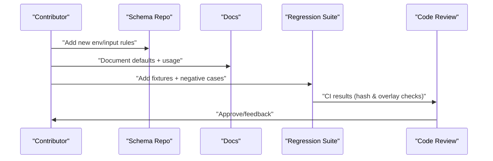

```mermaid
sequenceDiagram
  participant Dev as "Contributor"
  participant Schema as "Schema Repo"
  participant Docs as "Docs"
  participant Tests as "Regression Suite"
  participant Review as "Code Review"

  Dev->>Schema: "Add new env/input rules"
  Dev->>Docs: "Document defaults + usage"
  Dev->>Tests: "Add fixtures + negative cases"
  Tests->>Review: "CI results (hash & overlay checks)"
  Review->>Dev: "Approve/feedback"
```
