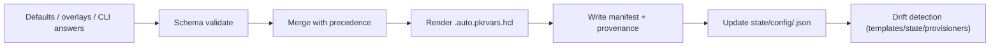

```mermaid
flowchart LR
  Inputs["Defaults / overlays / CLI answers"] --> Validate["Schema validate"]
  Validate --> Merge["Merge with precedence"]
  Merge --> Render["Render .auto.pkrvars.hcl"]
  Render --> Manifest["Write manifest + provenance"]
  Manifest --> State["Update state/config/<env>.json"]
  State --> Drift["Drift detection (templates/state/provisioners)"]
```
