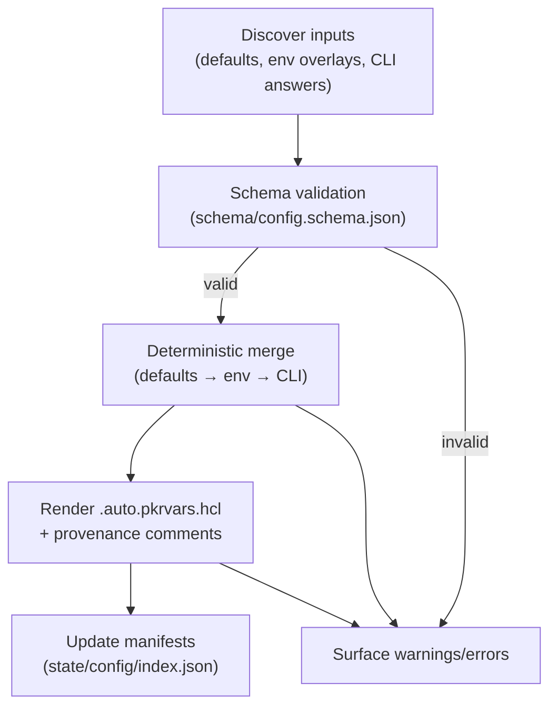

```mermaid
flowchart TD
  A["Discover inputs<br/>(defaults, env overlays, CLI answers)"]
  B["Schema validation<br/>(schema/config.schema.json)"]
  C["Deterministic merge<br/>(defaults → env → CLI)"]
  D["Render .auto.pkrvars.hcl<br/>+ provenance comments"]
  E["Update manifests<br/>(state/config/index.json)"]
  F["Surface warnings/errors"]

  A --> B
  B -->|valid| C
  B -->|invalid| F
  C --> D
  D --> E
  C --> F
  D --> F
```
