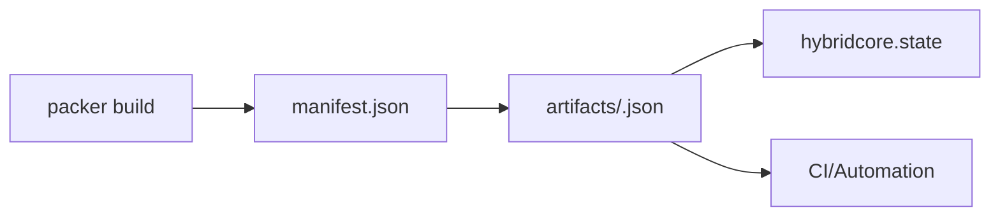

```mermaid
flowchart LR
  Build["packer build"]
  Manifest["manifest.json"]
  Artifacts["artifacts/<build>.json"]
  State["hybridcore.state"]
  CI["CI/Automation"]

  Build --> Manifest --> Artifacts
  Artifacts --> State
  Artifacts --> CI
```
