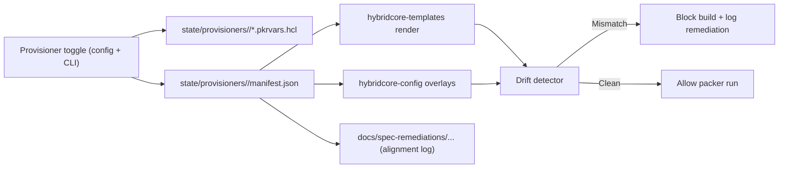

```mermaid
flowchart LR
  Toggle["Provisioner toggle (config + CLI)"] --> Vars["state/provisioners/<env>/*.pkrvars.hcl"]
  Toggle --> Manifest["state/provisioners/<env>/manifest.json"]
  Manifest --> Templates["hybridcore-templates render"]
  Manifest --> Config["hybridcore-config overlays"]
  Templates --> Drift["Drift detector"]
  Config --> Drift
  Drift -->|Mismatch| Block["Block build + log remediation"]
  Drift -->|Clean| Approve["Allow packer run"]
  Manifest --> Security["docs/spec-remediations/... (alignment log)"]
```
