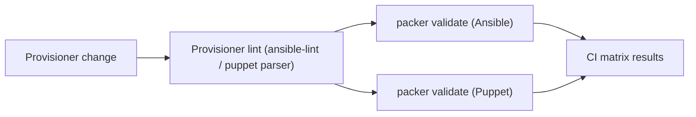

```mermaid
flowchart LR
  Change["Provisioner change"] --> Lint["Provisioner lint (ansible-lint / puppet parser)"]
  Lint --> ValidateAnsible["packer validate (Ansible)"]
  Lint --> ValidatePuppet["packer validate (Puppet)"]
  ValidateAnsible --> CI["CI matrix results"]
  ValidatePuppet --> CI
```
