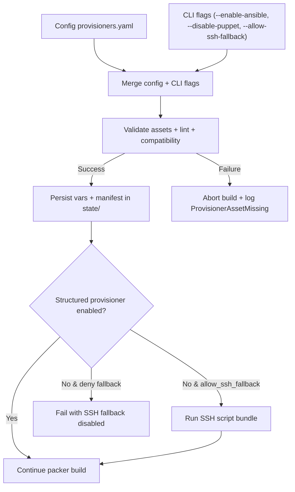

```mermaid
flowchart TD
  Config["Config provisioners.yaml"] --> Merge["Merge config + CLI flags"]
  CLI["CLI flags (--enable-ansible, --disable-puppet, --allow-ssh-fallback)"] --> Merge
  Merge --> Validate["Validate assets + lint + compatibility"]
  Validate -->|Success| Persist["Persist vars + manifest in state/"]
  Validate -->|Failure| Abort["Abort build + log ProvisionerAssetMissing"]
  Persist --> Structured{"Structured provisioner enabled?"}
  Structured -->|Yes| Build["Continue packer build"]
  Structured -->|No & allow_ssh_fallback| SSH["Run SSH script bundle"]
  Structured -->|No & deny fallback| Error["Fail with SSH fallback disabled"]
  SSH --> Build
```
