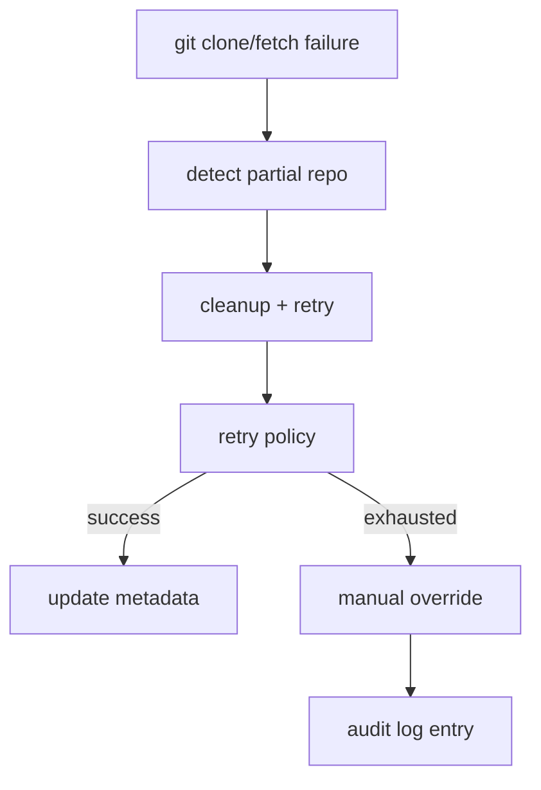

```mermaid
flowchart TD
  Fail["git clone/fetch failure"] --> Detect["detect partial repo"]
  Detect --> Cleanup["cleanup + retry"]
  Cleanup --> Backoff["retry policy"]
  Backoff -->|success| Update["update metadata"]
  Backoff -->|exhausted| Manual["manual override"]
  Manual --> Audit["audit log entry"]
```
