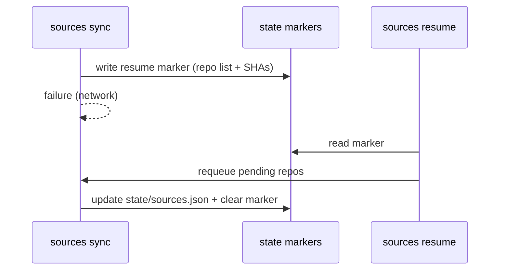

```mermaid
sequenceDiagram
  participant Sync as sources sync
  participant State as state markers
  participant Resume as sources resume
  Sync->>State: write resume marker (repo list + SHAs)
  Sync-->>Sync: failure (network)
  Resume->>State: read marker
  Resume->>Sync: requeue pending repos
  Sync->>State: update state/sources.json + clear marker
```
