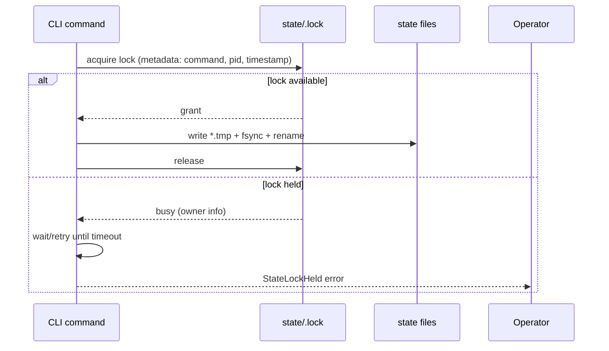

```mermaid
sequenceDiagram
  participant CLI as CLI command
  participant Lock as state/.lock
  participant State as state files
  CLI->>Lock: acquire lock (metadata: command, pid, timestamp)
  alt lock available
    Lock-->>CLI: grant
    CLI->>State: write *.tmp + fsync + rename
    CLI->>Lock: release
  else lock held
    Lock-->>CLI: busy (owner info)
    CLI->>CLI: wait/retry until timeout
    CLI-->>Operator: StateLockHeld error
  end
```
