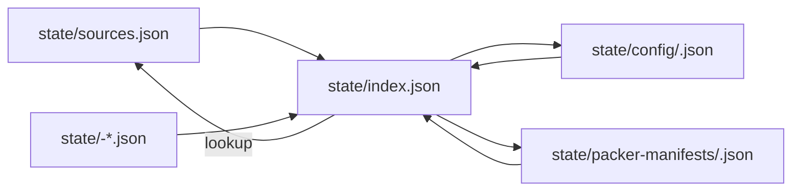

```mermaid
flowchart LR
  Sources["state/sources.json"]
  Config["state/config/<env>.json"]
  Index["state/index.json"]
  Packer["state/packer-manifests/<build>.json"]
  Other["state/<module>-*.json"]

  Sources --> Index
  Config --> Index
  Packer --> Index
  Other --> Index
  Index -->|lookup| Sources
  Index --> Config
  Index --> Packer
```
