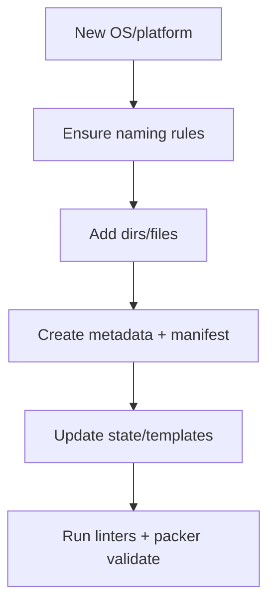

```mermaid
flowchart TD
  Start["New OS/platform"] --> Naming["Ensure naming rules"]
  Naming --> Files["Add dirs/files"]
  Files --> MetadataStep["Create metadata + manifest"]
  MetadataStep --> StateUpdate["Update state/templates"]
  StateUpdate --> Tests["Run linters + packer validate"]
```
