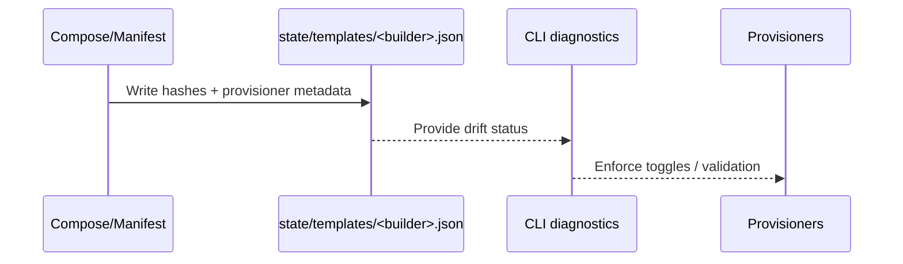

```mermaid
sequenceDiagram
  participant Compose as Compose/Manifest
  participant State as state/templates/<builder>.json
  participant CLI as CLI diagnostics
  participant Provisioners as Provisioners
  Compose->>State: Write hashes + provisioner metadata
  State-->>CLI: Provide drift status
  CLI-->>Provisioners: Enforce toggles / validation
```
