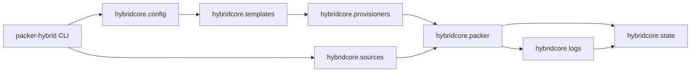
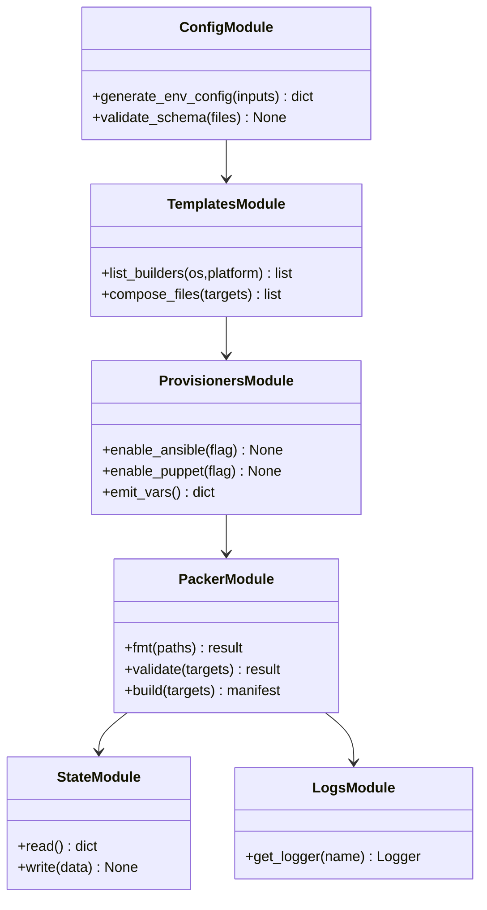
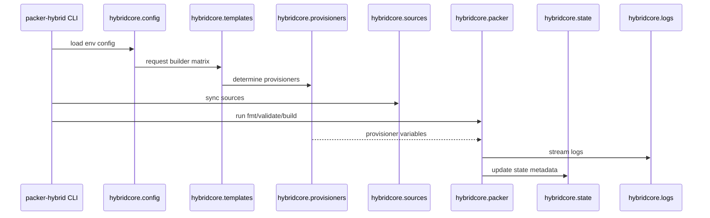

# hybridcore Specification

## Purpose

Describe the hybridcore package architecture, module boundaries, and diagrams so CLI/Django consumers rely on a shared stdlib-only orchestration layer for config, sources, templates, provisioners, packer, state, and logs.

## Requirements

### Requirement: Module Boundaries

`hybridcore` SHALL provide distinct stdlib-only modules for `config`, `sources`, `templates`, `provisioners`, `packer`, `state`, and `logs`.

#### Scenario: Dependency-free imports

- **WHEN** the CLI imports any hybridcore module
- **THEN** only Python standard library modules are loaded, ensuring zero third-party dependencies.

### Requirement: Config Rendering

`hybridcore.config` MUST render `.pkrvars.hcl` files from templates, merge environment overlays, and validate schemas before writing to `configs/<env>/`.

#### Scenario: Deterministic configs

- **WHEN** the same inputs are provided
- **THEN** `generate_env_config` MUST output identical files and raise descriptive errors for missing variables.

### Requirement: Source Management

`hybridcore.sources` SHALL clone/update plugin and example repositories under `sources/`, record SHAs, and refuse to proceed if the working tree is dirty.

#### Scenario: Pinned versions

- **WHEN** `sources sync` runs
- **THEN** it MUST update `state/packer-hybrid.json` with repo URLs and commit SHAs for reproducibility.

### Requirement: Template Composition

`hybridcore.templates` MUST list builders per OS/platform, enforce naming conventions (`source.<plugin>-iso.<name>` etc.), and assemble packer file lists for CLI commands.

#### Scenario: Builder catalog

- **WHEN** the CLI requests builders for `linux,proxmox`
- **THEN** the module MUST return canonical builder identifiers that follow the naming convention so downstream commands can reference them without string duplication.

### Requirement: Provisioner Coordination

`hybridcore.provisioners` SHALL expose toggles for Ansible (default) and Puppet (optional) stacks, verify required assets exist under `templates/ansible` or `templates/puppet`, and emit packer variables enabling/disabling each stack.

#### Scenario: Toggle enforcement

- **WHEN** Puppet is disabled for a build
- **THEN** the module MUST only emit Ansible variables and fail fast if required Ansible assets are missing; enabling Puppet MUST add the extra variables after verifying assets exist.

### Requirement: Packer Orchestration

`hybridcore.packer` MUST wrap `packer fmt/validate/build`, stream logs, parse manifests, and surface structured results (status, artifact IDs, timestamps).

#### Scenario: Structured results

- **WHEN** `hybridcore.packer` completes a build
- **THEN** it MUST return an object containing the packer exit code, manifest path, artifact IDs, timestamps, and any errors so the CLI can decide whether to continue.

### Requirement: State Management

`hybridcore.state` SHALL persist structured JSON containing plugin versions, repo SHAs, manifest hashes, and last-run metadata; updates MUST be atomic (write temp file, rename).

#### Scenario: Atomic writes

- **WHEN** state updates occur
- **THEN** the module MUST write to a temporary file in `state/`, fsync, and rename it to `state/packer-hybrid.json` to avoid corruption on crash.

### Requirement: Logging

`hybridcore.logs` MUST provide a shared logger format (timestamp, level, command) used by CLI, tests, and future Django services, and support log file rotation under `logs/`.

#### Scenario: Shared formatter

- **WHEN** the CLI and tests construct loggers via `hybridcore.logs`
- **THEN** they MUST both emit the same `[timestamp] level component` prefix and roll log files once they exceed the configured size.

### Requirement: Hybridcore Component Diagram

A detailed diagram of module interactions MUST live in this spec so contributors can trace how the CLI invokes each hybridcore subsystem; docs may include simplified references (see `docs/hybridcore-architecture.md`).

#### Scenario: Diagram availability

- **WHEN** a maintainer reviews module boundaries
- **THEN** they MUST be able to consult this diagram to confirm the call sequence before modifying hybridcore.

### Requirement: Hybridcore Class Diagram

This spec SHALL include a class diagram covering the primary classes/functions inside hybridcore modules to guide future contributors.

#### Scenario: Class coverage

- **WHEN** new abstractions are proposed
- **THEN** they MUST align with the class diagram below or update it as part of the change.

### Requirement: Packer-Hybrid Integration Diagram

Dependencies between the CLI entrypoints and hybridcore MUST be documented with a dedicated Mermaid sequence diagram to capture hand-offs.

#### Scenario: Dependency clarity

- **WHEN** engineers investigate coupling between CLI commands and hybridcore functions
- **THEN** they MUST rely on the diagram below to understand call order and shared assets.

### Requirement: Module Spec Hierarchy

This umbrella spec SHALL remain the high-level description of hybridcore. Detailed contracts for each module MUST live in sibling specs:

- `specs/hybridcore-config/spec.md`
- `specs/hybridcore-sources/spec.md`
- `specs/hybridcore-templates/spec.md`
- `specs/hybridcore-provisioners/spec.md`
- `specs/hybridcore-packer/spec.md`
- `specs/hybridcore-state/spec.md`
- `specs/hybridcore-logs/spec.md`

Each module spec MUST link back to this umbrella file and describe its own data contracts, serialization formats, dependency boundaries, and testing strategy.

#### Scenario: Adding a new module

- **WHEN** a new hybridcore module (e.g., `metrics`) is introduced
- **THEN** contributors MUST create `specs/hybridcore-metrics/spec.md`, reference it from this umbrella spec, and follow the naming convention `hybridcore-<module>`.

## Open Issues

See `docs/spec-remediations/hybridcore-remediations.md`.
