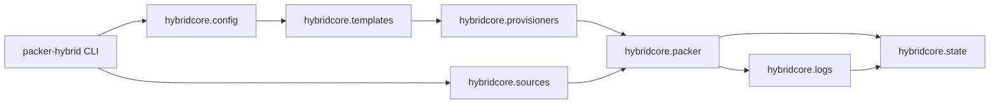
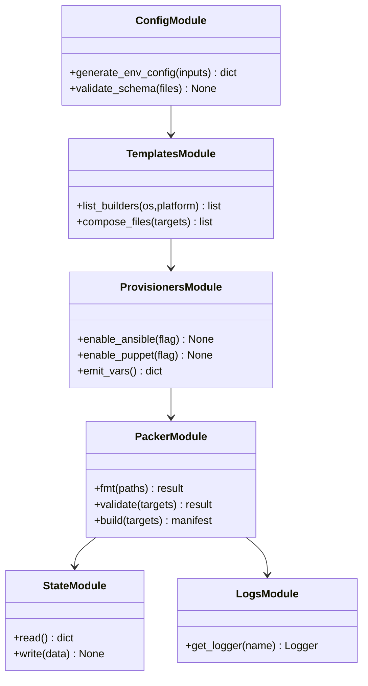

# hybridcore Specification

## Purpose

Describe the hybridcore package architecture, module boundaries, and diagrams so CLI/Django consumers rely on a shared stdlib-only orchestration layer for config, sources, templates, provisioners, packer, state, and logs.
## Requirements
### Requirement: Module Boundaries

`hybridcore` SHALL provide distinct stdlib-only modules for `config`, `sources`, `templates`, `provisioners`, `packer`, `state`, and `logs`.

#### Scenario: Dependency-free imports

- **WHEN** the CLI imports any hybridcore module
- **THEN** only Python standard library modules are loaded, ensuring zero third-party dependencies.

### Requirement: Config Rendering

`hybridcore.config` MUST render `.pkrvars.hcl` files from templates, merge environment overlays, and validate schemas before writing to `configs/<env>/`.

#### Scenario: Deterministic configs

- **WHEN** the same inputs are provided
- **THEN** `generate_env_config` MUST output identical files and raise descriptive errors for missing variables.

### Requirement: Source Management

`hybridcore.sources` SHALL clone/update plugin and example repositories under `sources/`, record SHAs, and refuse to proceed if the working tree is dirty.

#### Scenario: Pinned versions

- **WHEN** `sources sync` runs
- **THEN** it MUST update `state/packer-hybrid.json` with repo URLs and commit SHAs for reproducibility.

### Requirement: Template Composition

`hybridcore.templates` MUST list builders per OS/platform, enforce naming conventions (`source.<plugin>-iso.<name>` etc.), and assemble packer file lists for CLI commands.

#### Scenario: Builder catalog

- **WHEN** the CLI requests builders for `linux,proxmox`
- **THEN** the module MUST return canonical builder identifiers that follow the naming convention so downstream commands can reference them without string duplication.

### Requirement: Provisioner Coordination

`hybridcore.provisioners` SHALL expose toggles for Ansible (default) and Puppet (optional) stacks, verify required assets exist under `templates/ansible` or `templates/puppet`, and emit packer variables enabling/disabling each stack.

#### Scenario: Toggle enforcement

- **WHEN** Puppet is disabled for a build
- **THEN** the module MUST only emit Ansible variables and fail fast if required Ansible assets are missing; enabling Puppet MUST add the extra variables after verifying assets exist.

### Requirement: Packer Orchestration

`hybridcore.packer` MUST wrap `packer fmt/validate/build`, stream logs, parse manifests, and surface structured results (status, artifact IDs, timestamps).

#### Scenario: Structured results

- **WHEN** `hybridcore.packer` completes a build
- **THEN** it MUST return an object containing the packer exit code, manifest path, artifact IDs, timestamps, and any errors so the CLI can decide whether to continue.

### Requirement: State Management

`hybridcore.state` SHALL persist structured JSON containing plugin versions, repo SHAs, manifest hashes, and last-run metadata; updates MUST be atomic (write temp file, rename).

#### Scenario: Atomic writes

- **WHEN** state updates occur
- **THEN** the module MUST write to a temporary file in `state/`, fsync, and rename it to `state/packer-hybrid.json` to avoid corruption on crash.

### Requirement: Logging

`hybridcore.logs` MUST provide a shared logger format (timestamp, level, command) used by CLI, tests, and future Django services, and support log file rotation under `logs/`.

#### Scenario: Shared formatter

- **WHEN** the CLI and tests construct loggers via `hybridcore.logs`
- **THEN** they MUST both emit the same `[timestamp] level component` prefix and roll log files once they exceed the configured size.

### Requirement: Hybridcore Component Diagram

A detailed diagram of module interactions MUST live in this spec so contributors can trace how the CLI invokes each hybridcore subsystem; docs may include simplified references (see `docs/hybridcore-architecture.md`).

#### Scenario: Diagram availability

- **WHEN** a maintainer reviews module boundaries
- **THEN** they MUST be able to consult this diagram to confirm the call sequence before modifying hybridcore.

### Requirement: Hybridcore Class Diagram

This spec SHALL include a class diagram covering the primary classes/functions inside hybridcore modules to guide future contributors.

#### Scenario: Class coverage

- **WHEN** new abstractions are proposed
- **THEN** they MUST align with the class diagram below or update it as part of the change.

### Requirement: Packer-Hybrid Integration Diagram

The orchestration and sequence diagrams SHALL highlight governance/meta touchpoints (diagram verification, assessment cadence) and docs MUST link back to the spec diagrams to avoid drift.

#### Scenario: Diagram governance linkage

- **WHEN** governance/meta policies change
- **THEN** the diagrams SHALL show the touchpoints so contributors understand compliance flows.

### Requirement: Module Spec Hierarchy

The umbrella spec SHALL provide a matrix summarizing each module’s `## Open Issues` pointer, outstanding themes, and severity so readers do not jump between files blindly.

#### Scenario: Matrix upkeep

- **WHEN** module Open Issues change
- **THEN** the matrix SHALL be updated so umbrella readers see cross-module status at a glance.

### Requirement: Module Registry & Naming

The registry SHALL include a table listing each module’s name, spec path, implementation status, and remediation draft link so onboarding stays auditable.

#### Scenario: Registry visibility

- **WHEN** a new module is proposed or updated
- **THEN** the table SHALL record its status/spec/remediation link (and PR reference) before code merges.

### Requirement: Cross-Module Dependency Guidelines

Umbrella requirements MUST reference the authoritative module spec/remediation draft instead of duplicating module-level behaviour; cross-module guidance SHALL link to the relevant module documents.

#### Scenario: Avoid duplication

- **WHEN** the umbrella spec mentions a module’s behaviour
- **THEN** it SHALL link to the module spec/remediation draft rather than restating the requirement.

### Requirement: Escalation & Severity

Cross-module issues SHALL be assigned a severity (critical/high/medium) with documented response times (24h/3d/1 week respectively) and MUST reference governance/meta policies.

#### Scenario: Escalation rubric

- **WHEN** a critical cross-module issue is recorded
- **THEN** the release captain SHALL respond within 24h and update the remediation draft + matrix accordingly.

### Requirement: Orchestration Flow

The new orchestration diagram (`specs/hybridcore/orchestration-flow.md`) SHALL accompany the spec and remain up to date.

#### Scenario: Diagram upkeep

- **WHEN** module flows change
- **THEN** the orchestration diagram MUST be updated and referenced from the spec.

### Requirement: Open Issues Tracking

The hybridcore spec SHALL keep a `## Open Issues` section pointing to `assessments/2025-11-14-remediation-migration/remediations/hybridcore-remediations.md`. Assessments MUST summarize outstanding gaps per dimension in that doc and cross-reference it from the spec.

#### Scenario: Remediation linkage

- **WHEN** a spec assessment uncovers deviations for the hybridcore spec
- **THEN** contributors SHALL update `assessments/2025-11-14-remediation-migration/remediations/hybridcore-remediations.md` and refresh the spec's `## Open Issues` pointer before merging changes.

## Open Issues

See `assessments/2025-11-14-remediation-migration/remediations/hybridcore-remediations.md`.
