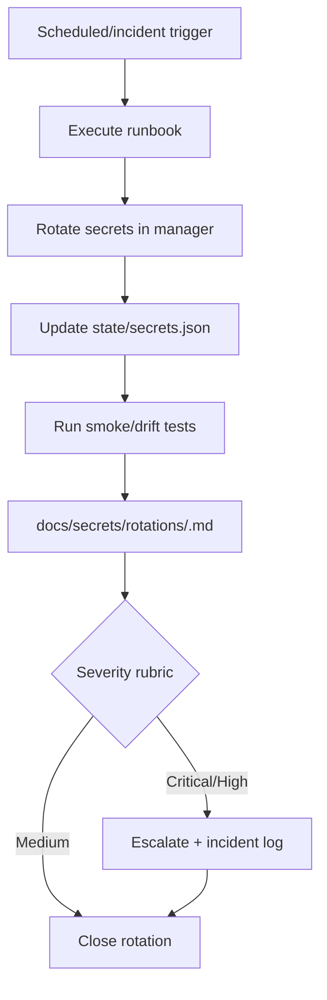

```mermaid
flowchart TD
  Schedule["Scheduled/incident trigger"] --> Runbook["Execute runbook"]
  Runbook --> Rotate["Rotate secrets in manager"]
  Rotate --> State["Update state/secrets.json"]
  State --> Smoke["Run smoke/drift tests"]
  Smoke --> Log["docs/secrets/rotations/<date>.md"]
  Log --> Severity{"Severity rubric"}
  Severity -->|Critical/High| Escalate["Escalate + incident log"]
  Severity -->|Medium| Close["Close rotation"]
  Escalate --> Close
```
