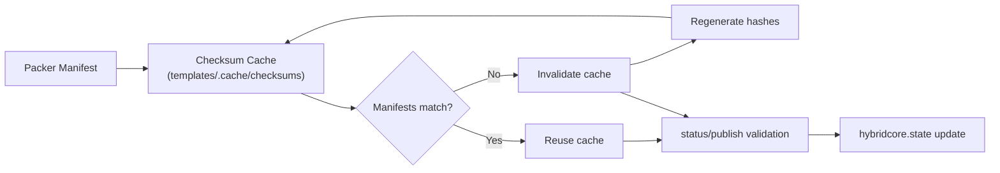

```mermaid
flowchart LR
  A["Packer Manifest"] --> B["Checksum Cache<br>(templates/.cache/checksums)"]
  B --> C{"Manifests match?"}
  C -->|Yes| D["Reuse cache"]
  C -->|No| E["Invalidate cache"]
  E --> F["Regenerate hashes"]
  F --> B
  D --> G["status/publish validation"]
  E --> G
  G --> H["hybridcore.state update"]
```
