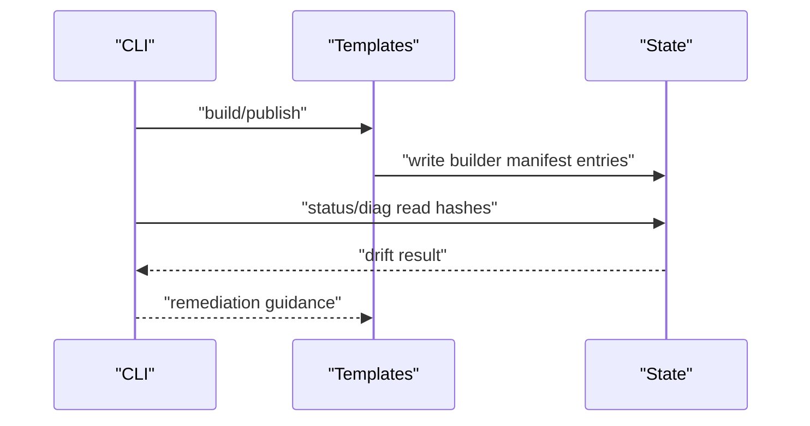

```mermaid
sequenceDiagram
  participant CLI as "CLI"
  participant Templates as "Templates"
  participant State as "State"
  CLI->>Templates: "build/publish"
  Templates->>State: "write builder manifest entries"
  CLI->>State: "status/diag read hashes"
  State-->>CLI: "drift result"
  CLI-->>Templates: "remediation guidance"
```
