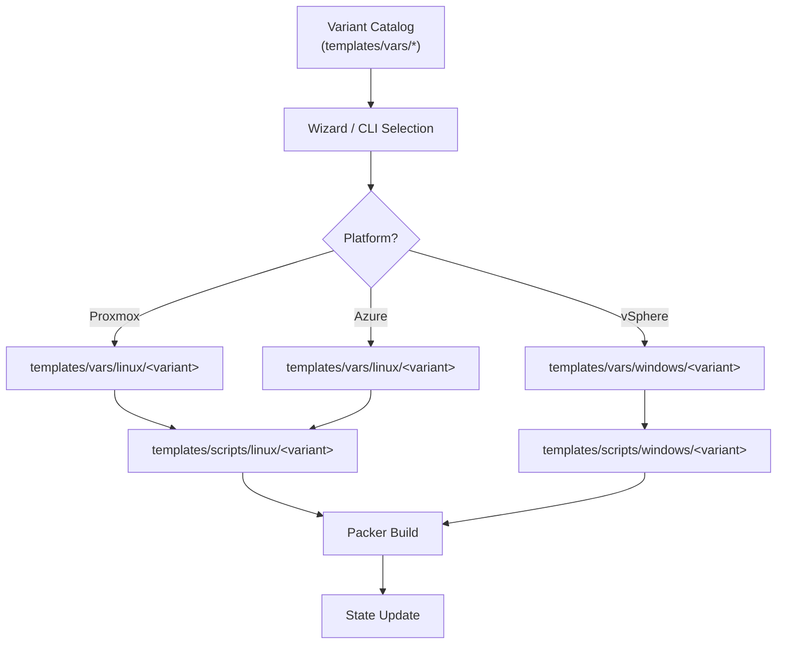

```mermaid
flowchart TD
  A["Variant Catalog<br>(templates/vars/*)"] --> B["Wizard / CLI Selection"]
  B --> C{"Platform?"}
  C -->|Proxmox| D["templates/vars/linux/&lt;variant&gt;"]
  C -->|vSphere| E["templates/vars/windows/&lt;variant&gt;"]
  C -->|Azure| F["templates/vars/linux/&lt;variant&gt;"]
  D --> G["templates/scripts/linux/&lt;variant&gt;"]
  E --> H["templates/scripts/windows/&lt;variant&gt;"]
  F --> G
  G --> I["Packer Build"]
  H --> I
  I --> J["State Update"]
```
